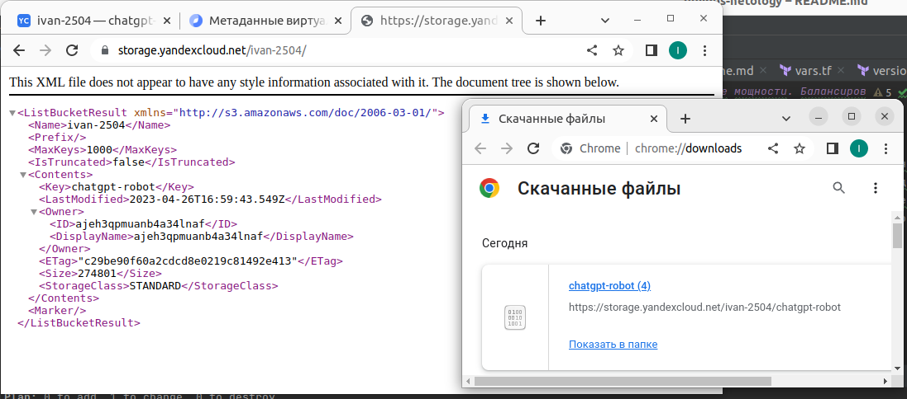

# Домашнее задание к занятию «Вычислительные мощности. Балансировщики нагрузки»  

### Подготовка к выполнению задания

1. Домашнее задание состоит из обязательной части, которую нужно выполнить на провайдере Yandex Cloud, и дополнительной части в AWS (выполняется по желанию). 
2. Все домашние задания в блоке 15 связаны друг с другом и в конце представляют пример законченной инфраструктуры.  
3. Все задания нужно выполнить с помощью Terraform. Результатом выполненного домашнего задания будет код в репозитории. 
4. Перед началом работы настройте доступ к облачным ресурсам из Terraform, используя материалы прошлых лекций и домашних заданий.

---
## Задание 1. Yandex Cloud 

**Что нужно сделать**

1. Создать бакет Object Storage и разместить в нём файл с картинкой:

 - Создать бакет в Object Storage с произвольным именем (например, _имя_студента_дата_).
 - Положить в бакет файл с картинкой.
 - Сделать файл доступным из интернета.

```terraform

// Создание бакета с помощью ключей
resource "yandex_storage_bucket" "ivan-2504" {
  access_key = yandex_iam_service_account_static_access_key.sa-static-key.access_key
  secret_key = yandex_iam_service_account_static_access_key.sa-static-key.secret_key
  bucket = "ivan-2504"
  default_storage_class = "STANDARD"
  acl           = "public-read"
  force_destroy = "true"

  anonymous_access_flags {
    read = true
    list = true
    config_read = true
  }
}

// Загрузка картинки в созданный бакет.
resource "yandex_storage_object" "chatgpt-robot" {
  access_key = yandex_iam_service_account_static_access_key.sa-static-key.access_key
  secret_key = yandex_iam_service_account_static_access_key.sa-static-key.secret_key
  bucket = "ivan-2504"
  key    = "chatgpt-robot"
  source = "../src/chatgpt-robot.jpg"
  depends_on = [
    yandex_storage_bucket.ivan-2504,
  ]
}
```
> 


2. Создать группу ВМ в public подсети фиксированного размера с шаблоном LAMP и веб-страницей, содержащей ссылку на картинку из бакета:

 - Создать Instance Group с тремя ВМ и шаблоном LAMP. Для LAMP рекомендуется использовать `image_id = fd827b91d99psvq5fjit`.
 - Для создания стартовой веб-страницы рекомендуется использовать раздел `user_data` в [meta_data](https://cloud.yandex.ru/docs/compute/concepts/vm-metadata).
 - Разместить в стартовой веб-странице шаблонной ВМ ссылку на картинку из бакета.
 - Настроить проверку состояния ВМ.
```terraform
resource "yandex_compute_instance_group" "group1" {
  name                = "test-ig"
  folder_id           = var.yc_folder_id
  service_account_id  = "${yandex_iam_service_account.sa.id}"
  deletion_protection = true
  instance_template {
    platform_id = "standard-v1"
    resources {
      memory = 2
      cores  = 2
    }
    boot_disk {
      mode = "READ_WRITE"
      initialize_params {
        image_id = "fd827b91d99psvq5fjit"
        size     = 4
      }
    }
    network_interface {
      network_id = "${yandex_vpc_network.network-1.id}"
      subnet_ids = ["${yandex_vpc_subnet.subnet-1.id}"]
      nat        = true
    }
    labels = {
      label1 = "label1-value"
      label2 = "label2-value"
    }
    metadata = {
      foo      = "bar"
      ssh-keys = "ubuntu:${file("~/.ssh/id_rsa.pub")}"
      user-data = "${file("../src/index.yaml")}"
    }
    network_settings {
      type = "STANDARD"
    }
  }

  variables = {
    test_key1 = "test_value1"
    test_key2 = "test_value2"
  }

  scale_policy {
    fixed_scale {
      size = 3
    }
  }

  allocation_policy {
    zones = ["ru-central1-a"]
  }

  deploy_policy {
    max_unavailable = 2
    max_creating    = 2
    max_expansion   = 2
    max_deleting    = 2
  }
}
```
>

 - Настроить проверку состояния ВМ.

3. Подключить группу к сетевому балансировщику:

 - Создать сетевой балансировщик.
 - Проверить работоспособность, удалив одну или несколько ВМ.
4. (дополнительно)* Создать Application Load Balancer с использованием Instance group и проверкой состояния.

Полезные документы:

- [Compute instance group](https://registry.terraform.io/providers/yandex-cloud/yandex/latest/docs/resources/compute_instance_group).
- [Network Load Balancer](https://registry.terraform.io/providers/yandex-cloud/yandex/latest/docs/resources/lb_network_load_balancer).
- [Группа ВМ с сетевым балансировщиком](https://cloud.yandex.ru/docs/compute/operations/instance-groups/create-with-balancer).

---
## Задание 2*. AWS (задание со звёздочкой)

Это необязательное задание. Его выполнение не влияет на получение зачёта по домашней работе.

**Что нужно сделать**

Используя конфигурации, выполненные в домашнем задании из предыдущего занятия, добавить к Production like сети Autoscaling group из трёх EC2-инстансов с  автоматической установкой веб-сервера в private домен.

1. Создать бакет S3 и разместить в нём файл с картинкой:

 - Создать бакет в S3 с произвольным именем (например, _имя_студента_дата_).
 - Положить в бакет файл с картинкой.
 - Сделать доступным из интернета.
2. Сделать Launch configurations с использованием bootstrap-скрипта с созданием веб-страницы, на которой будет ссылка на картинку в S3. 
3. Загрузить три ЕС2-инстанса и настроить LB с помощью Autoscaling Group.

Resource Terraform:

- [S3 bucket](https://registry.terraform.io/providers/hashicorp/aws/latest/docs/resources/s3_bucket)
- [Launch Template](https://registry.terraform.io/providers/hashicorp/aws/latest/docs/resources/launch_template).
- [Autoscaling group](https://registry.terraform.io/providers/hashicorp/aws/latest/docs/resources/autoscaling_group).
- [Launch configuration](https://registry.terraform.io/providers/hashicorp/aws/latest/docs/resources/launch_configuration).

Пример bootstrap-скрипта:

```
#!/bin/bash
yum install httpd -y
service httpd start
chkconfig httpd on
cd /var/www/html
echo "<html><h1>My cool web-server</h1></html>" > index.html
```****