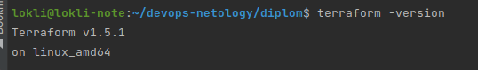
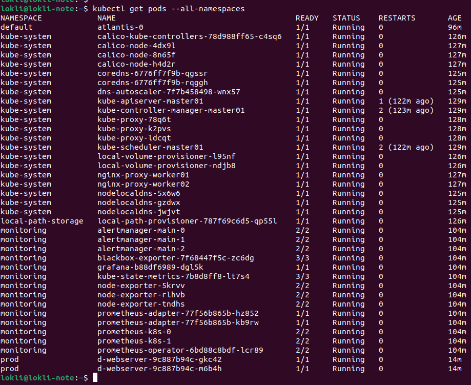
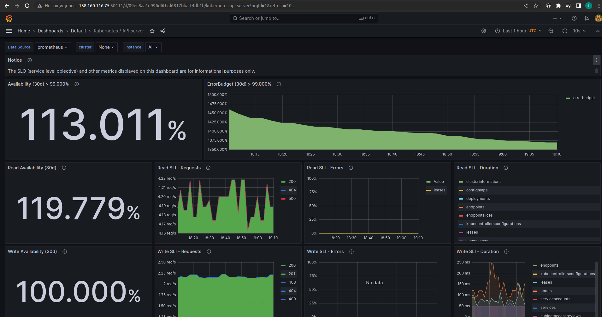
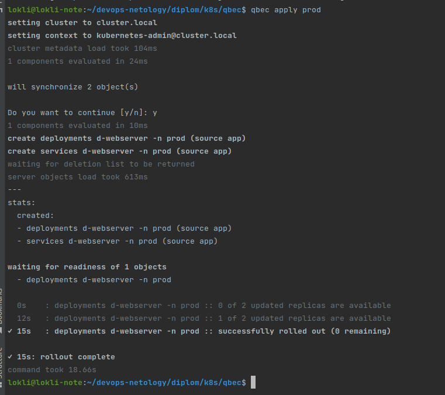
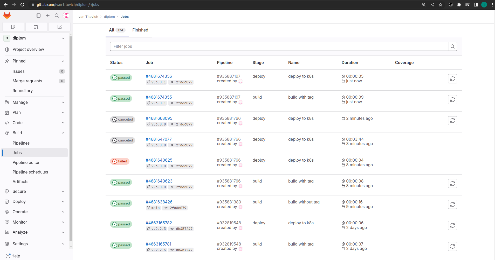
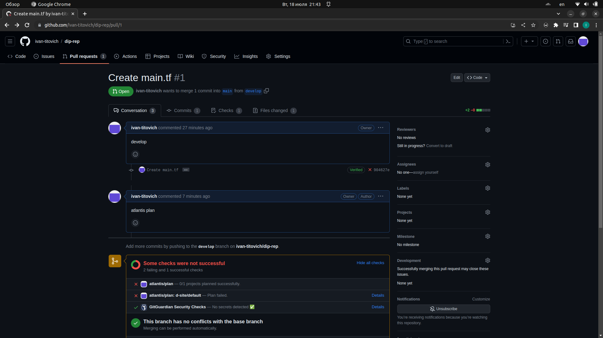
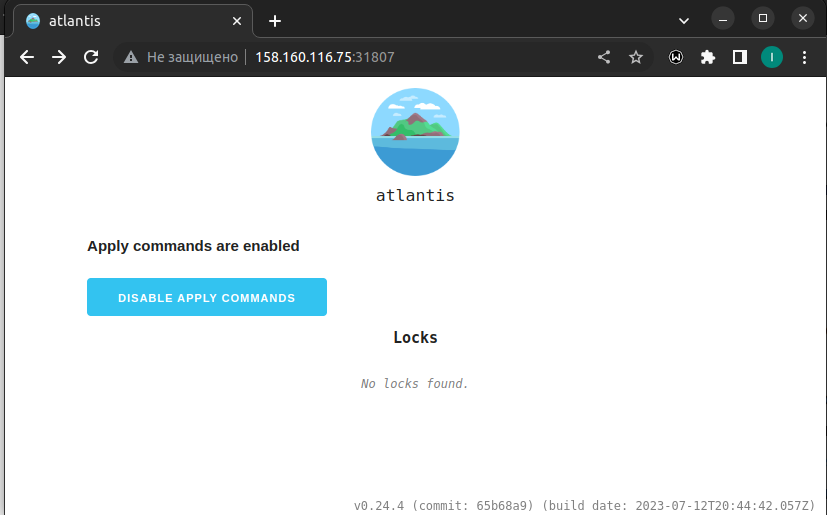

# Дипломный практикум в Yandex.Cloud
  * [Цели:](#цели)
  * [Этапы выполнения:](#этапы-выполнения)
     * [Создание облачной инфраструктуры](#создание-облачной-инфраструктуры)
     * [Создание Kubernetes кластера](#создание-kubernetes-кластера)
     * [Создание тестового приложения](#создание-тестового-приложения)
     * [Подготовка cистемы мониторинга и деплой приложения](#подготовка-cистемы-мониторинга-и-деплой-приложения)
     * [Установка и настройка CI/CD](#установка-и-настройка-cicd)
  * [Что необходимо для сдачи задания?](#что-необходимо-для-сдачи-задания)
  * [Как правильно задавать вопросы дипломному руководителю?](#как-правильно-задавать-вопросы-дипломному-руководителю)

---
## Цели:

1. Подготовить облачную инфраструктуру на базе облачного провайдера Яндекс.Облако.
2. Запустить и сконфигурировать Kubernetes кластер.
3. Установить и настроить систему мониторинга.
4. Настроить и автоматизировать сборку тестового приложения с использованием Docker-контейнеров.
5. Настроить CI для автоматической сборки и тестирования.
6. Настроить CD для автоматического развёртывания приложения.

---
## Этапы выполнения:


### Создание облачной инфраструктуры

Для начала необходимо подготовить облачную инфраструктуру в ЯО при помощи [Terraform](https://www.terraform.io/).

Особенности выполнения:

- Бюджет купона ограничен, что следует иметь в виду при проектировании инфраструктуры и использовании ресурсов;
- Следует использовать последнюю стабильную версию [Terraform](https://www.terraform.io/).

Предварительная подготовка к установке и запуску Kubernetes кластера.

1. Создайте сервисный аккаунт, который будет в дальнейшем использоваться Terraform для работы с инфраструктурой с необходимыми и достаточными правами. Не стоит использовать права суперпользователя

2. Подготовьте [backend](https://www.terraform.io/docs/language/settings/backends/index.html) для Terraform:  
   а. Рекомендуемый вариант: [Terraform Cloud](https://app.terraform.io/)  
   б. Альтернативный вариант: S3 bucket в созданном ЯО аккаунте
```https://cloud.yandex.ru/docs/tutorials/infrastructure-management/terraform-state-storage```
3. Настройте [workspaces](https://www.terraform.io/docs/language/state/workspaces.html)  
   а. Рекомендуемый вариант: создайте два workspace: *stage* и *prod*. В случае выбора этого варианта все последующие шаги должны учитывать факт существования нескольких workspace.  
   б. Альтернативный вариант: используйте один workspace, назвав его *stage*. Пожалуйста, не используйте workspace, создаваемый Terraform-ом по-умолчанию (*default*).
4. Создайте VPC с подсетями в разных зонах доступности.
5. Убедитесь, что теперь вы можете выполнить команды `terraform destroy` и `terraform apply` без дополнительных ручных действий.
6. В случае использования [Terraform Cloud](https://app.terraform.io/) в качестве [backend](https://www.terraform.io/docs/language/settings/backends/index.html) убедитесь, что применение изменений успешно проходит, используя web-интерфейс Terraform cloud.

Ожидаемые результаты:

1. Terraform сконфигурирован и создание инфраструктуры посредством Terraform возможно без дополнительных ручных действий.
2. Полученная конфигурация инфраструктуры является предварительной, поэтому в ходе дальнейшего выполнения задания возможны изменения.

------------
> 
> 
>
> Использовался вариант 2б - S3 bucket в yandex.cloud. [providers.tf](terraform/providers.tf)
>
> Инфраструтура разворачивается в yandex.cloud. Все конфигурациионные файлы в папке [terraform](./terraform)
> 
> Для ускорения разворачивани инфраструктуры создал Makefile, развернуть:
> 
```bash
make all
```
Удаление: 
```bash
make destroy
```
---
### Создание Kubernetes кластера

На этом этапе необходимо создать [Kubernetes](https://kubernetes.io/ru/docs/concepts/overview/what-is-kubernetes/) кластер на базе предварительно созданной инфраструктуры.   Требуется обеспечить доступ к ресурсам из Интернета.

Это можно сделать двумя способами:

1. Рекомендуемый вариант: самостоятельная установка Kubernetes кластера.  
   а. При помощи Terraform подготовить как минимум 3 виртуальных машины Compute Cloud для создания Kubernetes-кластера. Тип виртуальной машины следует выбрать самостоятельно с учётом требовании к производительности и стоимости. Если в дальнейшем поймете, что необходимо сменить тип инстанса, используйте Terraform для внесения изменений.  
   б. Подготовить [ansible](https://www.ansible.com/) конфигурации, можно воспользоваться, например [Kubespray](https://kubernetes.io/docs/setup/production-environment/tools/kubespray/)  
   в. Задеплоить Kubernetes на подготовленные ранее инстансы, в случае нехватки каких-либо ресурсов вы всегда можете создать их при помощи Terraform.
2. Альтернативный вариант: воспользуйтесь сервисом [Yandex Managed Service for Kubernetes](https://cloud.yandex.ru/services/managed-kubernetes)  
  а. С помощью terraform resource для [kubernetes](https://registry.terraform.io/providers/yandex-cloud/yandex/latest/docs/resources/kubernetes_cluster) создать региональный мастер kubernetes с размещением нод в разных 3 подсетях      
  б. С помощью terraform resource для [kubernetes node group](https://registry.terraform.io/providers/yandex-cloud/yandex/latest/docs/resources/kubernetes_node_group)
  
Ожидаемый результат:

1. Работоспособный Kubernetes кластер.
2. В файле `~/.kube/config` находятся данные для доступа к кластеру.
3. Команда `kubectl get pods --all-namespaces` отрабатывает без ошибок.
---
> При разворачивании инфраструктуры terraform формирует файлы для дальнейшего разворачивания kubernetes клсатера с помощью ansible и kubespray: 
> 
> [playbook для деплоя kubernetes кластера](./playbook/k8s/)
> 
> Формируется файл  [hosts](./playbook/k8s/inventory/hosts.yaml), [prod](./playbook/k8s/inventory/prod.yml) и в конфиг [k8s-cluster](./playbook/k8s/inventory/k8s-cluster.yml) добавляется IP-адрес соместимых с внешним адресом контрол-плейна SSL-сертификатов.
> 
> Для удобства генерируется файл [install](./install) в корне репозитория, который запускает ansible-playbook  по установке кластера, копирует данные подключения `~/.kube/config` и подготавливает рабочий комп в качестве runner-a для gitlab ci (с точки зрения экономии ресурсов и целесообразности не стал разворачивать под него отдельную ВМ в яндекс-клауде, но такое тоже возможно). 
> 
> Кластер развернулся успешно, скриншот вывода команды `kubectl get pods --all-namespaces`: 
> 
> 
> 

---
### Создание тестового приложения

Для перехода к следующему этапу необходимо подготовить тестовое приложение, эмулирующее основное приложение разрабатываемое вашей компанией.

Способ подготовки:

1. Рекомендуемый вариант:  
   а. Создайте отдельный git репозиторий с простым nginx конфигом, который будет отдавать статические данные.  
   б. Подготовьте Dockerfile для создания образа приложения.  
2. Альтернативный вариант:  
   а. Используйте любой другой код, главное, чтобы был самостоятельно создан Dockerfile.

Ожидаемый результат:

1. Git репозиторий с тестовым приложением и Dockerfile.
2. Регистр с собранным docker image. В качестве регистра может быть DockerHub или [Yandex Container Registry](https://cloud.yandex.ru/services/container-registry), созданный также с помощью terraform.

---
> Создан отдельный [github-репозиторий](https://github.com/ivan-titovich/dip-rep). 
>
> 
> 
> Так же создан отдельный [gitlab-репозиторий](https://gitlab.com/ivan-titovich/diplom.git). 
> 
>Создан docker image и залит в [DockerHub](https://hub.docker.com/r/titovichia/d-webserver)


---
### Подготовка cистемы мониторинга и деплой приложения

Уже должны быть готовы конфигурации для автоматического создания облачной инфраструктуры и поднятия Kubernetes кластера.  
Теперь необходимо подготовить конфигурационные файлы для настройки нашего Kubernetes кластера.

Цель:
1. Задеплоить в кластер [prometheus](https://prometheus.io/), [grafana](https://grafana.com/), [alertmanager](https://github.com/prometheus/alertmanager), [экспортер](https://github.com/prometheus/node_exporter) основных метрик Kubernetes.
2. Задеплоить тестовое приложение, например, [nginx](https://www.nginx.com/) сервер отдающий статическую страницу.

Рекомендуемый способ выполнения:
1. Воспользовать пакетом [kube-prometheus](https://github.com/prometheus-operator/kube-prometheus), который уже включает в себя [Kubernetes оператор](https://operatorhub.io/) для [grafana](https://grafana.com/), [prometheus](https://prometheus.io/), [alertmanager](https://github.com/prometheus/alertmanager) и [node_exporter](https://github.com/prometheus/node_exporter). При желании можете собрать все эти приложения отдельно.
2. Для организации конфигурации использовать [qbec](https://qbec.io/), основанный на [jsonnet](https://jsonnet.org/). Обратите внимание на имеющиеся функции для интеграции helm конфигов и [helm charts](https://helm.sh/)
3. Если на первом этапе вы не воспользовались [Terraform Cloud](https://app.terraform.io/), то задеплойте в кластер [atlantis](https://www.runatlantis.io/) для отслеживания изменений инфраструктуры.

Альтернативный вариант:
1. Для организации конфигурации можно использовать [helm charts](https://helm.sh/)

Ожидаемый результат:
1. Git репозиторий с конфигурационными файлами для настройки Kubernetes.
2. Http доступ к web интерфейсу grafana.
3. Дашборды в grafana отображающие состояние Kubernetes кластера.
4. Http доступ к тестовому приложению.
---
> Для установки Prometheus, Alertmanager и Grafana использовал kube-prometheus.
> 
> Для установки переходим в папку [k8s](./k8s) и запускаем скрипт: [install_grafana](./k8s/install_grafana), который:
> 
> Клонирует репозиторий (kube-prometheus)
> 
> Копирует в него манифесты для графаны в папку manifests:
> 
> [grafana-networkPolicy.yaml](./k8s/manifest/grafana-networkPolicy.yaml)
> 
> [grafana-service.yaml](./k8s/manifest/grafana-service.yaml)
> 
> и устанавливает, согласно инструкции, Prometheus, Alertmanager и Grafana в кластер (namespace monitoring)
> 
> [Ссылка на Grafana](http://158.160.116.75:30111/login)
> 
> Логин: `admin`
> 
> Пароль: `1Q2w3e4r`
> 
> 
> 
> 

> Для управления конфигурациями использовал qbec. 
> 
> Создаем 2 namespace-a: 
> 
> [namespaces](./k8s/manifest/namespaces.yml)
> 
> ` kubectl apply -f k8s/manifest/namespaces.yml`
> 
> Нужно в файле [qbec.yaml](k8s/qbec/qbec.yaml) прописать адрес kubernetes кластера, как в файле `~/.kube/config`
>
>  для применения конфигурации qbec: 
```bash
cd k8s/qbec/
qbec apply prod
```


После этого приложение из докер-образа задеплоилось в кластер и доступно по адресу:
http://158.160.116.75:30666

> Приложение до деплоя с помощью gitlab CI: 
> 
> [app-1](img/app-1.png)
> 
> Приложение после деплоя с помощью gitlab CI:
> 
> [app-2](img/app-2.png)
---
### Установка и настройка CI/CD

Осталось настроить ci/cd систему для автоматической сборки docker image и деплоя приложения при изменении кода.

Цель:

1. Автоматическая сборка docker образа при коммите в репозиторий с тестовым приложением.
2. Автоматический деплой нового docker образа.

Можно использовать [teamcity](https://www.jetbrains.com/ru-ru/teamcity/), [jenkins](https://www.jenkins.io/), [GitLab CI](https://about.gitlab.com/stages-devops-lifecycle/continuous-integration/) или GitHub Actions.

Ожидаемый результат:

1. Интерфейс ci/cd сервиса доступен по http.
2. При любом коммите в репозиторие с тестовым приложением происходит сборка и отправка в регистр Docker образа.
3. При создании тега (например, v1.0.0) происходит сборка и отправка с соответствующим label в регистр, а также деплой соответствующего Docker образа в кластер Kubernetes.


---
> Для CI/CD буду использовать Gitlab CI
> 
> Устанавил раннер согласно инструкции (не принципиально куда, т.к. он обращается по SSH к control-plane k8s и обновляет версию докер-образа). 
> 
> Т.к. при без тэга нельзя запушить образ в docker-registry - для не тэгированных коммитов собирается образ и пушится с тэгом test. 
> 
> Если в коммите присутствует тэг - собирается образ и пушится в репозиторий с указанным тэгом и обновляется приложение через ssh на контрол-плейне. 
> 
> CI/CD описан в файле [.gitlab-ci.yml](https://gitlab.com/ivan-titovich/diplom/-/blob/main/.gitlab-ci.yml)
> 
> [GITLAB](https://gitlab.com/ivan-titovich/diplom)
> 
> Результат выполнения (Перед отправкой на проверку перезапускал кластер - забыл поменять адрес контрол-плейна - поэтому сбой деплоя. Исправил - работает)
> 
> 

---
## Что необходимо для сдачи задания?

1. Репозиторий с конфигурационными файлами Terraform и готовность продемонстрировать создание всех ресурсов с нуля.
2. Пример pull request с комментариями созданными atlantis'ом или снимки экрана из Terraform Cloud.
3. Репозиторий с конфигурацией ansible, если был выбран способ создания Kubernetes кластера при помощи ansible.
4. Репозиторий с Dockerfile тестового приложения и ссылка на собранный docker image.
5. Репозиторий с конфигурацией Kubernetes кластера.
6. Ссылка на тестовое приложение и веб интерфейс Grafana с данными доступа.
7. Все репозитории рекомендуется хранить на одном ресурсе (github, gitlab)

---
1. https://github.com/ivan-titovich/devops-netology/tree/main/diplom/terraform
2. 
   
3. https://github.com/ivan-titovich/devops-netology/tree/main/diplom/playbook
4. https://github.com/ivan-titovich/dip-rep/tree/main/d-site 
   https://hub.docker.com/r/titovichia/d-webserver/tags
5. https://github.com/ivan-titovich/devops-netology/tree/main/diplom/k8s
6. Приложение: http://158.160.116.75:30666
    Графана: http://158.160.116.75:30111
    Логин: admin
    Пароль: 1Q2w3e4r


