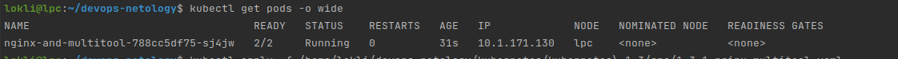
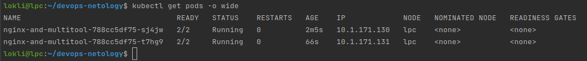
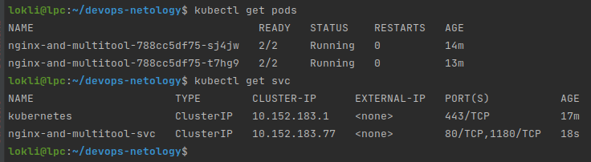
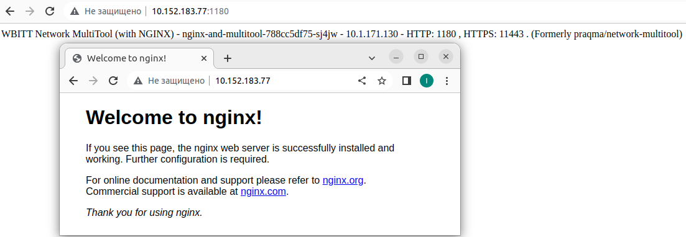

# Домашнее задание к занятию "Запуск приложений в K8S"

### Цель задания

В тестовой среде для работы с Kubernetes, установленной в предыдущем ДЗ, необходимо развернуть Deployment с приложением, состоящим из нескольких контейнеров и масштабировать его.

------

### Чеклист готовности к домашнему заданию

1. Установленное k8s-решение (например, MicroK8S)
2. Установленный локальный kubectl
3. Редактор YAML-файлов с подключенным github-репозиторием

------

### Инструменты/ дополнительные материалы, которые пригодятся для выполнения задания

1. [Описание](https://kubernetes.io/docs/concepts/workloads/controllers/deployment/) Deployment и примеры манифестов
2. [Описание](https://kubernetes.io/docs/concepts/workloads/pods/init-containers/) Init-контейнеров
3. [Описание](https://github.com/wbitt/Network-MultiTool) Multitool

------

### Задание 1. Создать Deployment и обеспечить доступ к репликам приложения из другого Pod'а

1. Создать Deployment приложения состоящего из двух контейнеров - nginx и multitool. Решить возникшую ошибку
> Ошибка возникала в связи с тем, что оба контейнера занимали 80 порт (http - сервера)
> 
> multitool перемапил на другие порты: 
> 
> 
```yaml
apiVersion: apps/v1
kind: Deployment
metadata:
  name: nginx-and-multitool
  labels:
    app: nginx-and-multitool
spec:
  replicas: 1
  selector:
    matchLabels:
      app: nginx-and-multitool

  template:
    metadata:
      labels:
        app: nginx-and-multitool
    spec:
      containers:
      - name: nginx
        image: nginx:latest
        ports:
         - containerPort: 80
      - name: multitool
        image: wbitt/network-multitool
        env:
          - name: HTTP_PORT
            value: "1180"
          - name: HTTPS_PORT
            value: "11443"
```
2. После запуска увеличить кол-во реплик работающего приложения до 2
3. Продемонстрировать кол-во подов до и после масштабирования
> До 
> 
> После 
> 

4. Создать Service, который обеспечит доступ до реплик приложений из п.1
> Service: 
> Скриншот доступности сервиса: 
> 
5. Создать отдельный Pod с приложением multitool и убедиться с помощью `curl` что из пода есть доступ до приложений из п.1
> [Под создан этим конфигом](src/1-3-1-multitool_pod.yaml)
>
> Вывод подов и запуск команды `curl` из пода (`kubectl exec multitool -- curl http://10.152.183.77:80`): 
```shell
lokli@lpc:~/devops-netology$ kubectl get pods
NAME                                   READY   STATUS    RESTARTS   AGE
nginx-and-multitool-788cc5df75-sj4jw   2/2     Running   0          28m
nginx-and-multitool-788cc5df75-t7hg9   2/2     Running   0          27m
multitool                              1/1     Running   0          6m25s
lokli@lpc:~/devops-netology$ kubectl exec multitool -- curl http://10.152.183.77:80
  % Total    % Received % Xferd  Average Speed   Time    Time     Time  Current
                                 Dload  Upload   Total   Spent    Left  Speed
100   615  100   615    0     0   823k      0 --:--:-- --:--:-- --:--:--  600k
<!DOCTYPE html>
<html>
<head>
<title>Welcome to nginx!</title>
<style>
html { color-scheme: light dark; }
body { width: 35em; margin: 0 auto;
font-family: Tahoma, Verdana, Arial, sans-serif; }
</style>
</head>
<body>
<h1>Welcome to nginx!</h1>
<p>If you see this page, the nginx web server is successfully installed and
working. Further configuration is required.</p>

<p>For online documentation and support please refer to
<a href="http://nginx.org/">nginx.org</a>.<br/>
Commercial support is available at
<a href="http://nginx.com/">nginx.com</a>.</p>

<p><em>Thank you for using nginx.</em></p>
</body>
</html>

```
------

### Задание 2. Создать Deployment и обеспечить старт основного контейнера при выполнении условий

1. Создать Deployment приложения nginx и обеспечить старт контейнера только после того, как будет запущен сервис этого приложения
> [deployament-nginx.yaml](src/1-3-2-nginx.yaml)
3. Убедиться, что nginx не стартует. В качестве init-контейнера взять busybox
> logs: 
```
$ kubectl logs nginx-74fb6dccd6-gp7gq  -c check-svc
nslookup: can't resolve 'nginx-svc'
Server:    10.152.183.10
Address 1: 10.152.183.10 kube-dns.kube-system.svc.cluster.local

waiting for nginx-svc
Server:    10.152.183.10
Address 1: 10.152.183.10 kube-dns.kube-system.svc.cluster.local

nslookup: can't resolve 'nginx-svc'
waiting for nginx-svc
```
> [Screenshot](src/nginx-init-logs.png)
3. Создать и запустить Service. Убедиться, что nginx запустился
>[nginx-service.yaml](src/1-3-2-nginx_svc.yaml)
```
kubectl get svc
NAME         TYPE        CLUSTER-IP       EXTERNAL-IP   PORT(S)   AGE
kubernetes   ClusterIP   10.152.183.1     <none>        443/TCP   22h
nginx-svc    ClusterIP   10.152.183.127   <none>        80/TCP    6m56s

```
```
kubectl get pods
NAME                     READY   STATUS    RESTARTS   AGE
nginx-74fb6dccd6-gp7gq   1/1     Running   0          73s
nginx-74fb6dccd6-9xwqd   1/1     Running   0          12s

```
4. Продемонстрировать состояние пода до и после запуска сервиса
> До запуска сервиса:
```
kubectl get pods
NAME                     READY   STATUS                  RESTARTS      AGE
nginx-b975d4d7c-ckn4s    0/1     Init:CrashLoopBackOff   4 (51s ago)   2m35s
nginx-5b9748c78d-vhqrt   0/1     Init:CrashLoopBackOff   5 (45s ago)   3m49s
nginx-74fb6dccd6-gp7gq   0/1     Init:0/1                0             7s


```
> После запуска сервиса: 
```
NAME                     READY   STATUS    RESTARTS   AGE
nginx-74fb6dccd6-gp7gq   1/1     Running   0          73s
nginx-74fb6dccd6-9xwqd   1/1     Running   0          12s


```
[Screenshot 2](src/running-pod-when-service-started.png)

