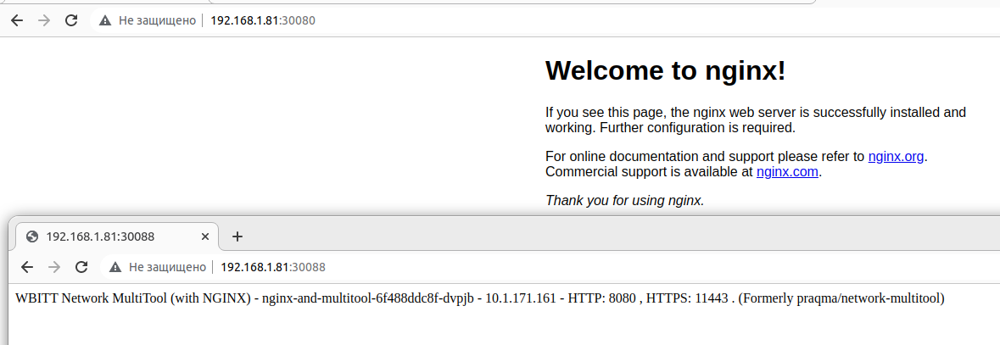

# Домашнее задание к занятию "Сетевое взаимодействие в K8S. Часть 1"

### Цель задания

В тестовой среде Kubernetes необходимо обеспечить доступ к приложению, установленному в предыдущем ДЗ и состоящему из двух контейнеров, по разным портам в разные контейнеры как внутри кластера, так и снаружи.

------

### Чеклист готовности к домашнему заданию

1. Установленное k8s-решение (например, MicroK8S)
2. Установленный локальный kubectl
3. Редактор YAML-файлов с подключенным git-репозиторием

------

### Инструменты/ дополнительные материалы, которые пригодятся для выполнения задания

1. [Описание](https://kubernetes.io/docs/concepts/workloads/controllers/deployment/) Deployment и примеры манифестов
2. [Описание](https://kubernetes.io/docs/concepts/services-networking/service/) Описание Service
3. [Описание](https://github.com/wbitt/Network-MultiTool) Multitool

------

### Задание 1. Создать Deployment и обеспечить доступ к контейнерам приложения по разным портам из другого Pod'а внутри кластера

1. Создать Deployment приложения, состоящего из двух контейнеров - nginx и multitool с кол-вом реплик 3шт.
> [deployment config](config/1-4-1-nginx_multitool.yaml)
2. Создать Service, который обеспечит доступ внутри кластера до контейнеров приложения из п.1 по порту 9001 - nginx 80, по 9002 - multitool 8080.
> [service config](config/1-4-1-nginx_multitool_svc.yaml)
3. Создать отдельный Pod с приложением multitool и убедиться с помощью `curl`, что из пода есть доступ до приложения из п.1 по разным портам в разные контейнеры
> [multitool pod config](config/1-4-1-multitool_pod.yaml)
>
> logs: 
``` 
$ kubectl exec multitool -- curl http://10.152.183.213:9001

  % Total    % Received % Xferd  Average Speed   Time    Time     Time  Current
                                 Dload  Upload   Total   Spent    Left  Speed
100   615  100   615    0     0   887k      0 --:--:-- --:--:-- --:--:--  600k
<!DOCTYPE html>
<html>
<head>
<title>Welcome to nginx!</title>
<style>
html { color-scheme: light dark; }
body { width: 35em; margin: 0 auto;
font-family: Tahoma, Verdana, Arial, sans-serif; }
</style>
</head>
<body>
<h1>Welcome to nginx!</h1>
<p>If you see this page, the nginx web server is successfully installed and
working. Further configuration is required.</p>

<p>For online documentation and support please refer to
<a href="http://nginx.org/">nginx.org</a>.<br/>
Commercial support is available at
<a href="http://nginx.com/">nginx.com</a>.</p>

<p><em>Thank you for using nginx.</em></p>
</body>
</html>


$ kubectl exec multitool -- curl http://10.152.183.213:9002

WBITT Network MultiTool (with NGINX) - nginx-and-multitool-6f488ddc8f-dvpjb - 10.1.171.161 - HTTP: 8080 , HTTPS: 11443 . (Formerly praqma/network-multitool)
  % Total    % Received % Xferd  Average Speed   Time    Time     Time  Current
                                 Dload  Upload   Total   Spent    Left  Speed
100   157  100   157    0     0   204k      0 --:--:-- --:--:-- --:--:--  153k
```
4. Продемонстрировать доступ с помощью `curl` по доменному имени сервиса.
> [curl by domain name service](src/curl_by_dns.png)
>
> 
``` 
kubectl exec multitool -- curl http://nginx-and-multitool-svc:9001

  % Total    % Received % Xferd  Average Speed   Time    Time     Time  Current
                                 Dload  Upload   Total   Spent    Left  Speed
100   615  100   615    0     0   543k      0 --:--:-- --:--:-- --:--:--  600k
<!DOCTYPE html>
<html>
<head>
<title>Welcome to nginx!</title>
<style>
html { color-scheme: light dark; }
body { width: 35em; margin: 0 auto;
font-family: Tahoma, Verdana, Arial, sans-serif; }
</style>
</head>
<body>
<h1>Welcome to nginx!</h1>
<p>If you see this page, the nginx web server is successfully installed and
working. Further configuration is required.</p>

<p>For online documentation and support please refer to
<a href="http://nginx.org/">nginx.org</a>.<br/>
Commercial support is available at
<a href="http://nginx.com/">nginx.com</a>.</p>

<p><em>Thank you for using nginx.</em></p>
</body>
</html>


kubectl exec multitool -- curl http://nginx-and-multitool-svc:9002

  % Total    % Received % Xferd  Average Speed   Time    Time     Time  Current
                                 Dload  Upload   Total   Spent    Left  Speed
100   157  100   157    0     0   177k      0 --:--:-- --:--:-- --:--:--  153k
WBITT Network MultiTool (with NGINX) - nginx-and-multitool-6f488ddc8f-st5sw - 10.1.171.160 - HTTP: 8080 , HTTPS: 11443 . (Formerly praqma/network-multitool)

```
5. Предоставить манифесты Deployment'а и Service в решении, а также скриншоты или вывод команды п.4

> Summary:
> 
> [deployment config](config/1-4-1-nginx_multitool.yaml)
> 
> [service config](config/1-4-1-nginx_multitool_svc.yaml)
> 
> [multitool pod config](config/1-4-1-multitool_pod.yaml)
> 
> [curl by domain name service](src/curl_by_dns.png)
> 
------

### Задание 2. Создать Service и обеспечить доступ к приложениям снаружи кластера

1. Создать отдельный Service приложения из Задания 1 с возможностью доступа снаружи кластера к nginx используя тип NodePort.
> [nodePort service config](config/1-4-2-nodeport_svc.yaml)
>
2. Продемонстрировать доступ с помощью браузера или `curl` с локального компьютера.
> [screenshot nodePort works](src/nodeport_works.png)
3. Предоставить манифест и Service в решении, а также скриншоты или вывод команды п.2.
> Summary: 
> 
> [nodePort service config](config/1-4-2-nodeport_svc.yaml)
> 
> 
> 
> 
> 
> 
> 

