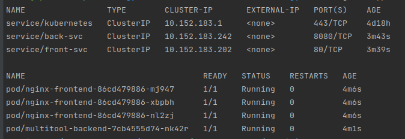
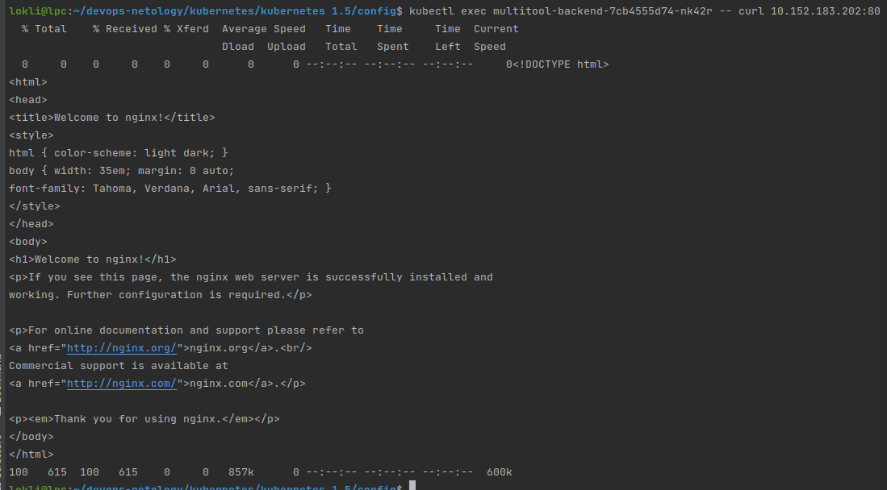
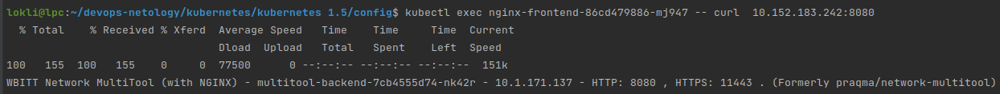
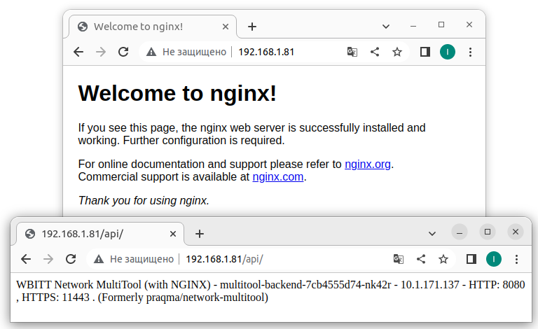

# Домашнее задание к занятию "Сетевое взаимодействие в K8S. Часть 2"

### Цель задания

В тестовой среде Kubernetes необходимо обеспечить доступ к двум приложениям снаружи кластера по разным путям.

------

### Чеклист готовности к домашнему заданию

1. Установленное k8s-решение (например, MicroK8S).
2. Установленный локальный kubectl.
3. Редактор YAML-файлов с подключенным git-репозиторием.

------

### Инструменты/ дополнительные материалы, которые пригодятся для выполнения задания

1. [Инструкция](https://microk8s.io/docs/getting-started) по установке MicroK8S
2. [Описание](https://kubernetes.io/docs/concepts/services-networking/service/) Service
3. [Описание](https://kubernetes.io/docs/concepts/services-networking/ingress/) Ingress
4. [Описание](https://github.com/wbitt/Network-MultiTool) Multitool

------

### Задание 1. Создать Deployment приложений backend и frontend

1. Создать Deployment приложения _frontend_ из образа nginx с кол-вом реплик 3 шт.
> [nginx fronted deployment config](config/1-5-1-nginx_front.yaml)
2. Создать Deployment приложения _backend_ из образа multitool.
> [multitool backend deployment config](config/1-5-1-multitool_back.yaml)
3. Добавить Service'ы, которые обеспечат доступ к обоим приложениям внутри кластера.
> [nginx fronted service config](config/1-5-1-front_svc.yaml)
>
> [multitool backend service config](config/1-5-1-back_svc.yaml)
4. Продемонстрировать, что приложения видят друг друга с помощью Service.
> Адреса и имена запущенных сервисов и подов: 
> 
> 
> Видимость из бэкэнд-пода фронтэнд-сервис: 
> 
> 
> 
> Видимость из фронтэнд-пода бэкэнд-сервис: 
> 
> 
> 

5. Предоставить манифесты Deployment'а и Service в решении, а также скриншоты или вывод команды п.4.
> Summary:
> 
> [nginx fronted deployment config](config/1-5-1-nginx_front.yaml)
> 
> [multitool backend deployment config](config/1-5-1-multitool_back.yaml)
> 
> [nginx fronted service config](config/1-5-1-front_svc.yaml)
>
> [multitool backend service config](config/1-5-1-back_svc.yaml)
> 
> Адреса и имена запущенных сервисов и подов: 
> 
> [services and pods](src/1-5-1_services_and_pods.png)
> 
> Видимость из бэкэнд-пода фронтэнд-сервис: 
> 
> [back to front](src/back-to-front.png)
> 
> Видимость из фронтэнд-пода бэкэнд-сервис: 
> 
> [front to back](src/front-to-back.png)
> 
------

### Задание 2. Создать Ingress и обеспечить доступ к приложениям снаружи кластера

1. Включить Ingress-controller в microk8s
> Done. 
2. Создать Ingress, обеспечивающий доступ снаружи по IP-адресу кластера microk8s, так чтобы при запросе только по адресу открывался _frontend_ а при добавлении /api - _backend_
> [ingress config](config/1-5-2-ingress.yaml)
> 
> [Конфигурация стенда(screenshot)](src/1-5-2_addresses_and_names.png)
> 
> curl: 
> 
``` 
$ curl 127.0.0.1/api/
WBITT Network MultiTool (with NGINX) - multitool-backend-7cb4555d74-nk42r - 10.1.171.137 - HTTP: 8080 , HTTPS: 11443 . (Formerly praqma/network-multitool)
$ curl 127.0.0.1
<!DOCTYPE html>
<html>
<head>
<title>Welcome to nginx!</title>
<style>
html { color-scheme: light dark; }
body { width: 35em; margin: 0 auto;
font-family: Tahoma, Verdana, Arial, sans-serif; }
</style>
</head>
<body>
<h1>Welcome to nginx!</h1>
<p>If you see this page, the nginx web server is successfully installed and
working. Further configuration is required.</p>

<p>For online documentation and support please refer to
<a href="http://nginx.org/">nginx.org</a>.<br/>
Commercial support is available at
<a href="http://nginx.com/">nginx.com</a>.</p>

<p><em>Thank you for using nginx.</em></p>
</body>
</html>
```
3. Продемонстрировать доступ с помощью браузера или `curl` с локального компьютера
> 
4. Предоставить манифесты, а также скриншоты или вывод команды п.2
> Summary
> 
> [ingress config](config/1-5-2-ingress.yaml)
> 
> [Конфигурация стенда(screenshot)](src/1-5-2_addresses_and_names.png)
> 
> [proof](src/1-5-2_proof.png)
------

### Правила приема работы

1. Домашняя работа оформляется в своем Git репозитории в файле README.md. Выполненное домашнее задание пришлите ссылкой на .md-файл в вашем репозитории.
2. Файл README.md должен содержать скриншоты вывода необходимых команд `kubectl`, а также скриншоты результатов
3. Репозиторий должен содержать тексты манифестов или ссылки на них в файле README.md

------