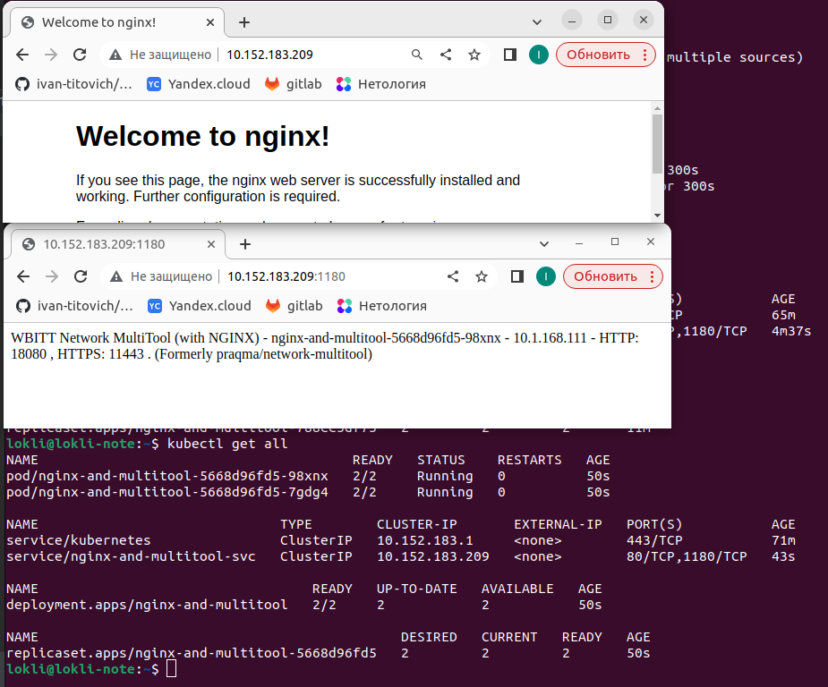
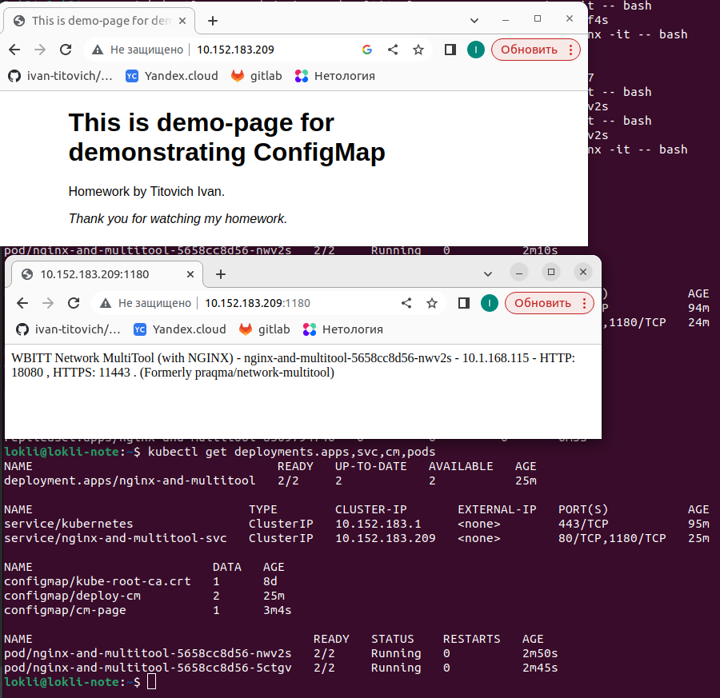
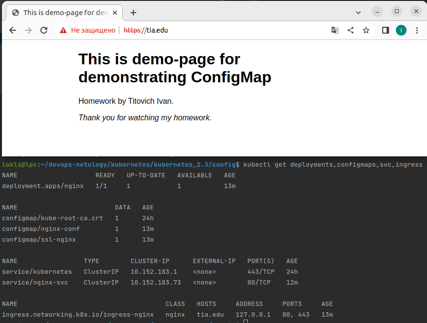
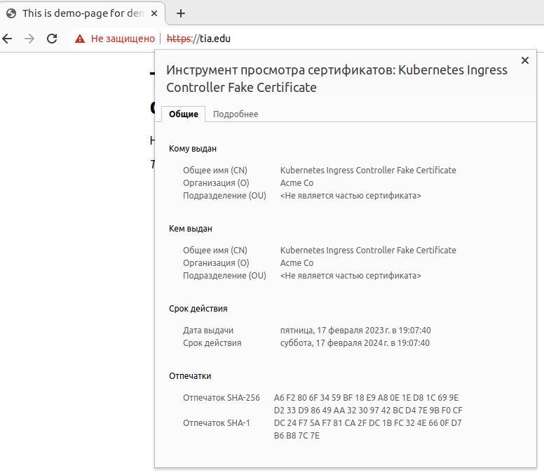

# Домашнее задание к занятию "Конфигурация приложений"

### Цель задания

В тестовой среде Kubernetes необходимо создать конфигурацию и продемонстрировать работу приложения.

------

### Чеклист готовности к домашнему заданию

1. Установленное k8s-решение (например, MicroK8S).
2. Установленный локальный kubectl.
3. Редактор YAML-файлов с подключенным github-репозиторием.

------

### Инструменты/ дополнительные материалы, которые пригодятся для выполнения задания

1. [Описание](https://kubernetes.io/docs/concepts/configuration/secret/) Secret
2. [Описание](https://kubernetes.io/docs/concepts/configuration/configmap/) ConfigMap
3. [Описание](https://github.com/wbitt/Network-MultiTool) Multitool

------

### Задание 1. Создать Deployment приложения и решить возникшую проблему с помощью ConfigMap. Добавить web-страницу

1. Создать Deployment приложения, состоящего из контейнеров busybox и multitool.

> 
> [deploymen config (multitool and busybox) with ConfigMap](config/2-3-1-deploy.yaml)
>
> 
2. Решить возникшую проблему с помощью ConfigMap
>Busybox не конфликтует с multitool. Nginx конфликтует с multitool из-за использования одинакового номера порта. Поэтому я сделал deployment, ConfigMap, Service для стэка nginx-mooltitool: 
> 
> [deployment nginx-multitool](config/2-3-1-nginx_multitool.yaml)
> 
> [service nginx-multitool](config/2-3-1-nginx_multitool_svc.yaml)
> 
> [ConfigMap nginx-multitool](config/2-3-1-cm.yaml)
> 
> 

3. Продемонстрировать, что pod стартовал, и оба конейнера работают.
> 
> 
4. Сделать простую web-страницу и подключить ее к Nginx с помощью ConfigMap. Подключить Service и показать вывод curl или в браузере.
>  Чтобы не плодить файлы на каждую пару конфигов в монтирующийся volume нужно создать отдельный ConfigMap со страницей: 
> 
> [ConfigMap for page](config/2-3-1-cm_page.yaml)
> 
> И подключить его как volume: 
> 
> [config nginx_multitool](config/2-3-1-nginx_multitool.yaml)
> 
> Сервис не изменится. 
> 
> Скриншот (по аналогии с предыдущим, но страница nginx изменена): 
> 
> 
> 

5. Предоставить манифесты, а также скриншоты и/или вывод необходимых команд.
>Summary: 
> 
> 
> [deployment nginx-multitool](config/2-3-1-nginx_multitool.yaml)
> 
> [service nginx-multitool](config/2-3-1-nginx_multitool_svc.yaml)
> 
> [ConfigMap nginx-multitool](config/2-3-1-cm.yaml)
> 
> [ConfigMap for page](config/2-3-1-cm_page.yaml)
> 
> [config nginx_multitool](config/2-3-1-nginx_multitool.yaml)
> 
> [screenshot](src/2-3-1-4-page_by_volume.png)

------

### Задание 2. Создать приложение с вашей web-страницей, доступной по HTTPS 

1. Создать Deployment приложения состоящего из nginx.
> [deployment config ](config/2-3-2-nginx.yaml)
2. Создать собственную web-страницу и подключить ее как ConfigMap к приложению.
>Взял страницу из предыдущего задания
> 
>[nginx page](config/2-3-2-cm-nginx-page.yaml) 
3. Выпустить самоподписной сертификат SSL. Создать Secret для использования данного сертификата.
> Выпуск производится командой: `sudo openssl req -x509 -nodes -days 365 -newkey rsa:2048 -keyout /etc/ssl/private/nginx-selfsigned.key -out /etc/ssl/certs/nginx-selfsigned.crt`
>
>Перевел данные из сертификата и ключа в base64, добавил в Secret
> 
> [nginx secret](config/2-3-2-nginx-secrets.yaml) 
> 
> 
4. Создать Ingress и необходимый Service, подключить к нему SSL в вид. Продемонстировать доступ к приложению по HTTPS.
>Если допустить, что на границе нашей инфраструктуры стоит ingress и все что за ним - в защищенном контуре, то внутри ssl-шифрование не нужно. 
> 
> Поэтому до ingress - https, после - http. 
> 
> [ingress config](config/2-3-2-ingress-nginx.yaml)
> 
> [service config](config/2-3-2-nginx_svc.yaml)
>
> Выпустил самоподписанные сертификаты командой: `sudo openssl req -x509 -nodes -days 365 -newkey rsa:2048 -keyout /etc/ssl/private/nginx-test.key -out /etc/ssl/certs/nginx-test.crt`
> 
> Перевел их в base64 командами: `sudo cat /etc/ssl/private/nginx-test.key|base64` и `sudo cat /etc/ssl/certs/nginx-test.crt|base64`
> 
> создал [secrets](config/2-3-2-nginx-secrets.yaml)
> 
> Выпускал сертификат на домен tia.edu - прописал его в /etc/hosts
> 

5. Предоставить манифесты, а также скриншоты и/или вывод необходимых команд.

> В итоге получилось: 
> 
> 
> 
> 

