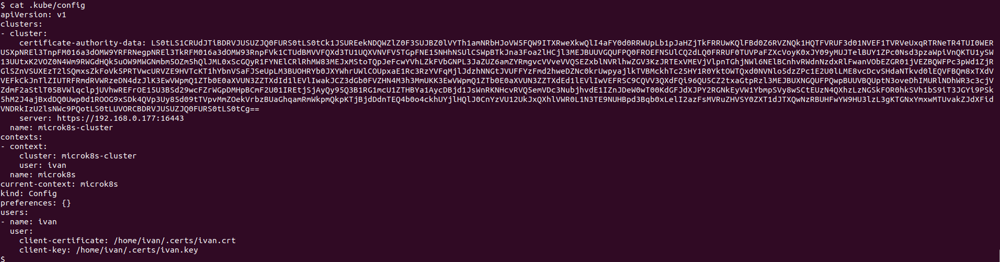
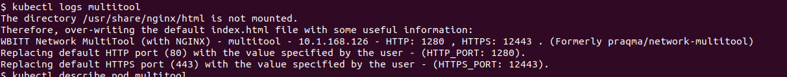
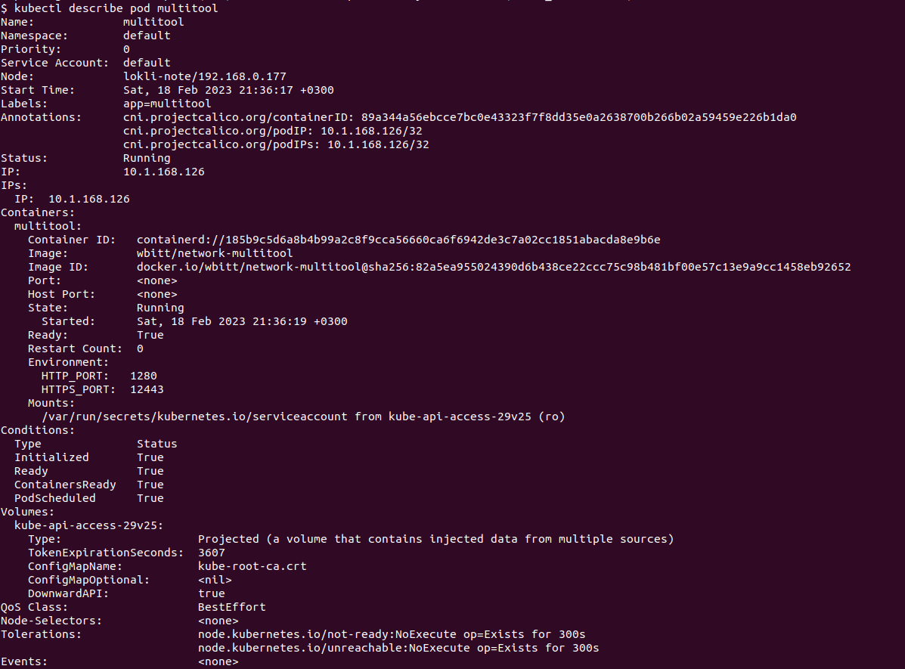
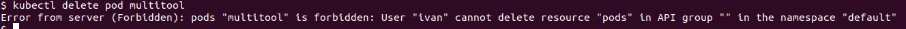

# Домашнее задание к занятию "Управление доступом"

### Цель задания

В тестовой среде Kubernetes необходимо предоставить ограниченный доступ пользователю.

------

### Чеклист готовности к домашнему заданию

1. Установленное k8s-решение (например, MicroK8S)
2. Установленный локальный kubectl
3. Редактор YAML-файлов с подключенным github-репозиторием

------

### Инструменты/ дополнительные материалы, которые пригодятся для выполнения задания

1. [Описание](https://kubernetes.io/docs/reference/access-authn-authz/rbac/) RBAC
2. [Пользователи и авторизация RBAC в Kubernetes](https://habr.com/ru/company/flant/blog/470503/)
3. [RBAC with Kubernetes in Minikube](https://medium.com/@HoussemDellai/rbac-with-kubernetes-in-minikube-4deed658ea7b)

------

### Задание 1. Создать конфигурацию для подключения пользователя

1. Создать и подписать SSL-сертификат для подключения к кластеру.
>  Сделано: 
>
 ``` 
openssl req -new -key ivan.key \
-out ivan.csr \
-subj "/CN=ivan"
```

 ``` 
openssl x509 -req -in ivan.csr \
-CA /var/snap/microk8s/current/certs/ca.crt \
-CAkey /var/snap/microk8s/current/certs/ca.key \
-CAcreateserial \
-out ivan.crt -days 500
```
`mkdir .certs && mv ivan.crt ivan.key .certs`
``` 
kubectl config set-credentials ivan \
--client-certificate=/home/ivan/.certs/ivan.crt \
--client-key=/home/ivan/.certs/ivan.key
```
``` 
kubectl config set-context microk8s \
--cluster=microk8s-cluster --user=ivan
```

> По итогу сертификаты нового пользователя ivan по адресу `/home/ivan/.certs/`
>
2. Настроить конфигурационный файл kubectl для подключения

> 
> 
3. Создать Роли и все необходимые настройки для пользователя

> [pod config](config/2-4-1-multitool_pod.yaml)
> 
> [roles config](config/2-4-1-roles.yaml)
> 
> [rolesBinding config](config/2-4-1-rb-roles.yaml)

4. Предусмотреть права пользователя. Пользователь может просматривать логи подов и их конфигурацию (`kubectl logs pod <pod_id>`, `kubectl describe pod <pod_id>`)

> Права пользователя для ресурсов pods и pods/log только get, watch, list: 
> 
``` 
resources: [ "pods", "pods/log" ]
verbs: [ get, watch, list]
```
5. Предоставить манифесты, а также скриншоты и/или вывод необходимых команд.

> [pod config](config/2-4-1-multitool_pod.yaml)
> 
> [roles config](config/2-4-1-roles.yaml)
> 
> [rolesBinding config](config/2-4-1-rb-roles.yaml)
> 
> Screenshots: 
> 
> 
> 
> 
> 
> При попытке, например, удалить pod - ошибка: 
> 
> 

------
