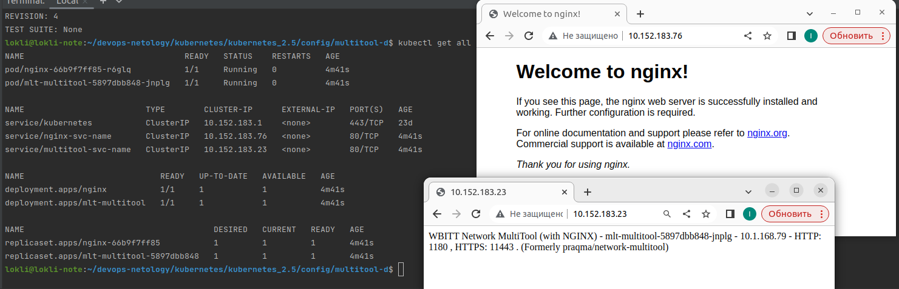
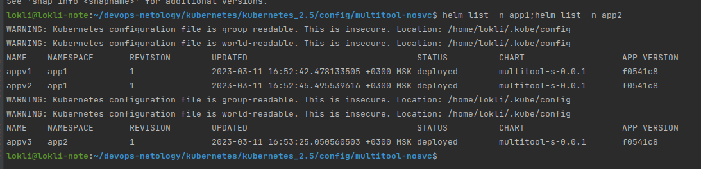

# Домашнее задание к занятию "Helm"

### Цель задания

В тестовой среде Kubernetes необходимо установить и обновить приложения с помощью Helm.

------

### Чеклист готовности к домашнему заданию

1. Установленное k8s-решение (например, MicroK8S)
2. Установленный локальный kubectl
3. Установленный локальный helm
4. Редактор YAML-файлов с подключенным github-репозиторием

------

### Инструменты/ дополнительные материалы, которые пригодятся для выполнения задания

1. [Инструкция](https://helm.sh/docs/intro/install/) по установке Helm. [Helm completion](https://helm.sh/docs/helm/helm_completion/)

------

### Задание 1. Подготовить helm чарт для приложения

1. Необходимо упаковать приложение в чарт для деплоя в разные окружения. 
> Упаковал mutlitool с nginx. Оба приложения деплоятся  из разных deployments и на каждое из них создается свой сервис.
> 
>
> [Multitool and nginx Chart. ](config/multitool-d)
> 
> 
> 
2. Каждый компонент приложения деплоится отдельным deployment’ом/statefulset’ом/
> [templates-deployments:](config/multitool-d/templates/deployments)
>
> 
3. В переменных чарта измените образ приложения для изменения версии.
> Создал отдельный [Chart](config/multitool-s) nолько с multitool, т.к. тэги 2х приложений скорее всего не совпадут(кроме latest, вероятно).
> 
> При измении в Chart,yaml параметра appVersion на тэг версии image-a устанавливаться будет он, в противном случае - "latest" из конфигурации (values.yaml)
> 


------
### Задание 2. Запустить 2 версии в разных неймспейсах

1. Подготовив чарт, необходимо его проверить. Запуститe несколько копий приложения.
> [Chart](config/multitool-nosvc) 

2. Одну версию в namespace=app1, вторую версию в том же неймспейсе;третью версию в namespace=app2.
> namespace app1, app version 1
```shell
$ helm install -n  app1  appv1 .
NAME: appv1
LAST DEPLOYED: Sat Mar 11 16:52:42 2023
NAMESPACE: app1
STATUS: deployed
REVISION: 1
TEST SUITE: None

```
> namespace app1, app version 2
```shell
$ helm install -n  app1  appv2 .
NAME: appv2
LAST DEPLOYED: Sat Mar 11 16:52:45 2023
NAMESPACE: app1
STATUS: deployed
REVISION: 1
TEST SUITE: None


``` 
> namespace app2, app version 3
```shell
**$ helm install -n  app2  appv3 .
NAME: appv3
LAST DEPLOYED: Sat Mar 11 16:53:25 2023
NAMESPACE: app2
STATUS: deployed
REVISION: 1
TEST SUITE: None**

```
3. Продемонстрируйте результат/
> 
