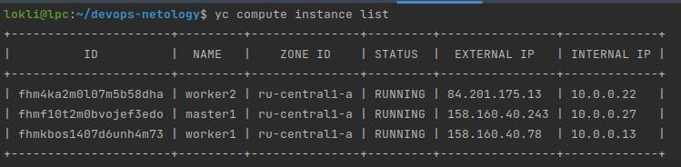
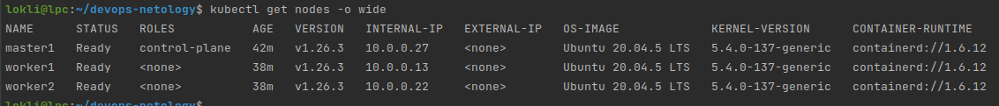
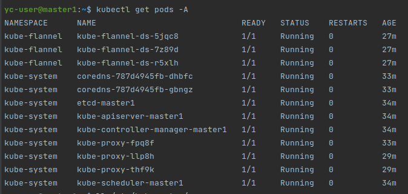
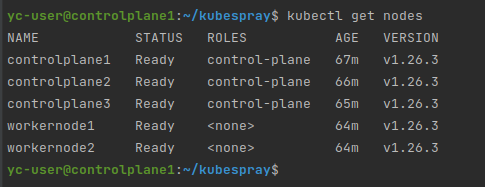
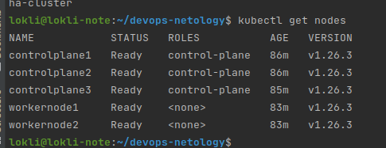

# Домашнее задание к занятию "Установка кластера K8s"

### Цель задания

Установить кластер K8s.

### Чеклист готовности к домашнему заданию

1. Развернутые ВМ с ОС Ubuntu 20.04-lts


### Инструменты и дополнительные материалы, которые пригодятся для выполнения задания

1. [Инструкция по установке kubeadm](https://kubernetes.io/docs/setup/production-environment/tools/kubeadm/create-cluster-kubeadm/)
2. [Документация kubespray](https://kubespray.io/)

-----

### Задание 1. Установить кластер k8s с 1 master node

1. Подготовка работы кластера из 5 нод: 1 мастер и 4 рабочие ноды.
> В связи с отсутствием бесплатного досупа к облакам и отсуствия свободного производительного сервера ради экономия средств количество worker нод пришлось уменьшить до 2х. Принципиально ничего не изменилось.
>
3. В качестве CRI — containerd.
> 
3. Запуск etcd производить на мастере.
> 
4. Способ установки выбрать самостоятельно.
> Установку производил с помощью kubeadm. 
> 
> На мастер-ноде: 
> Установка минимального набора ПО
```shell script
{
    sudo apt-get update
    sudo apt-get install -y apt-transport-https ca-certificates curl
    sudo curl -fsSLo /usr/share/keyrings/kubernetes-archive-keyring.gpg https://packages.cloud.google.com/apt/doc/apt-key.gpg
    echo "deb [signed-by=/usr/share/keyrings/kubernetes-archive-keyring.gpg] https://apt.kubernetes.io/ kubernetes-xenial main" | sudo tee /etc/apt/sources.list.d/kubernetes.list
    
    sudo apt-get update
    sudo apt-get install -y kubelet kubeadm kubectl containerd
    sudo apt-mark hold kubelet kubeadm kubectl
}
```
> Включение ip-forward:
```shell script

modprobe br_netfilter 
echo "net.ipv4.ip_forward=1" >> /etc/sysctl.conf
echo "net.bridge.bridge-nf-call-iptables=1" >> /etc/sysctl.conf
echo "net.bridge.bridge-nf-call-arptables=1" >> /etc/sysctl.conf
echo "net.bridge.bridge-nf-call-ip6tables=1" >> /etc/sysctl.conf

sysctl -p /etc/sysctl.conf
```
> 
> Инициализация ноды
```shell script
kubeadm init \
  --apiserver-advertise-address=10.0.0.27 \
  --pod-network-cidr 10.244.0.0/16 \
  --apiserver-cert-extra-sans=158.160.40.243
```
>По итогу получаем команду для подключения воркеров к ноде: 
``` shell script
kubeadm join 10.0.0.27:6443 --token gx9amz.zk20q3ythz55mji3 \
        --discovery-token-ca-cert-hash sha256:20a60c74ba3ab888479587c752f90c3610b1180f27fd364a4028e5a5649c84e5 
```


> На воркер-нодах: 
> Установка минимального набора ПО
```shell script
{
    sudo apt-get update
    sudo apt-get install -y apt-transport-https ca-certificates curl
    sudo curl -fsSLo /usr/share/keyrings/kubernetes-archive-keyring.gpg https://packages.cloud.google.com/apt/doc/apt-key.gpg
    echo "deb [signed-by=/usr/share/keyrings/kubernetes-archive-keyring.gpg] https://apt.kubernetes.io/ kubernetes-xenial main" | sudo tee /etc/apt/sources.list.d/kubernetes.list
    
    sudo apt-get update
    sudo apt-get install -y kubelet kubeadm kubectl containerd
    sudo apt-mark hold kubelet kubeadm kubectl
}
```
> Включение ip-forward:
```shell script

modprobe br_netfilter 
echo "net.ipv4.ip_forward=1" >> /etc/sysctl.conf
echo "net.bridge.bridge-nf-call-iptables=1" >> /etc/sysctl.conf
echo "net.bridge.bridge-nf-call-arptables=1" >> /etc/sysctl.conf
echo "net.bridge.bridge-nf-call-ip6tables=1" >> /etc/sysctl.conf

sysctl -p /etc/sysctl.conf
```
>По итогу получаем команду для подключения воркеров к ноде: 
``` shell script
kubeadm join 10.0.0.27:6443 --token gx9amz.zk20q3ythz55mji3 \
        --discovery-token-ca-cert-hash sha256:20a60c74ba3ab888479587c752f90c3610b1180f27fd364a4028e5a5649c84e5 
```
> Все поднялось, кластер заработал. Ноды друг-друга увидели. 
>


## Дополнительные задания (со звездочкой*)

**Настоятельно рекомендуем выполнять все задания под звёздочкой.**   Их выполнение поможет глубже разобраться в материале.   
Задания под звёздочкой дополнительные (необязательные к выполнению) и никак не повлияют на получение вами зачета по этому домашнему заданию. 

------
### Задание 2*. Установить HA кластер

1. Установить кластер в режиме HA
> Для развертывания кластера в режиме HA использовал kubespray. 
>
> [hosts.yaml](src/hosts.yaml)
> 
> Согласно [инструкции kubespray](https://github.com/kubernetes-sigs/kubespray/blob/master/docs/ha-mode.md) для использования kubernetes в HA режиме нужно в файл inventory/mycluster/all/all.yaml изменить настройки на: 
```yaml
## Internal loadbalancers for apiservers
loadbalancer_apiserver_localhost: true
# valid options are "nginx" or "haproxy"
loadbalancer_apiserver_type: nginx  # valid values "nginx" or "haproxy"
```

2. Использовать нечетное кол-во Master-node
> Для тестирования работы k8s в HA режиме использовал 3 control-plane ноды и 2 worker-node.
> 
> 
> 
> Локально:
> 
> 

3. Для cluster ip использовать keepalived или другой способ
> Разворачивал с помощью kubespray, описал выше.


### Правила приема работы

1. Домашняя работа оформляется в своем Git репозитории в файле README.md. Выполненное домашнее задание пришлите ссылкой на .md-файл в вашем репозитории.
2. Файл README.md должен содержать скриншоты вывода необходимых команд `kubectl get nodes`, а также скриншоты результатов
3. Репозиторий должен содержать тексты манифестов или ссылки на них в файле README.md