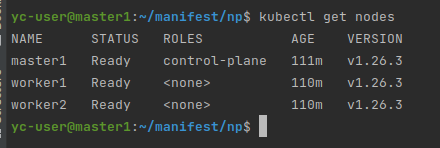
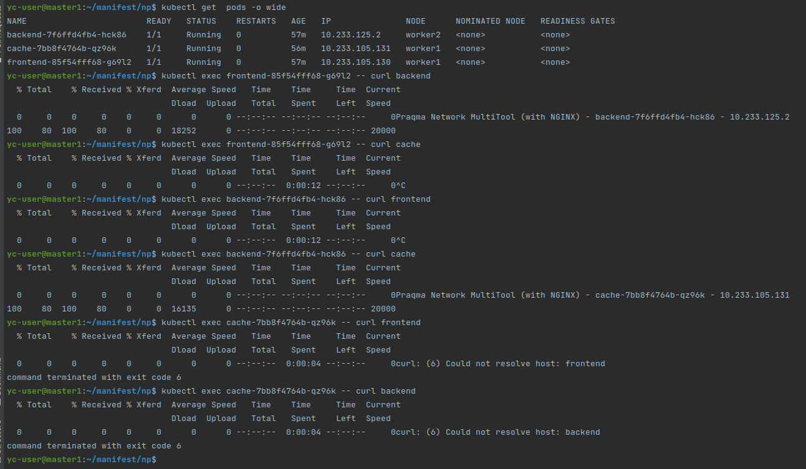

# Домашнее задание к занятию "Как работает сеть в K8S"

### Цель задания

Настроить сетевую политику доступа к подам.

### Чеклист готовности к домашнему заданию

1. Кластер k8s с установленным сетевым плагином calico

### Инструменты и дополнительные материалы, которые пригодятся для выполнения задания

1. [Документация Calico](https://www.tigera.io/project-calico/)
2. [Network Policy](https://kubernetes.io/docs/concepts/services-networking/network-policies/)
3. [About Network Policy](https://docs.projectcalico.org/about/about-network-policy)

-----

### Задание 1. Создать сетевую политику (или несколько политик) для обеспечения доступа

1. Создать deployment'ы приложений frontend, backend и cache и соответсвующие сервисы.
> deployments and services: 
>
> [frontend](src/manifests/frontend-dep-svc.yaml)
> 
> [backend](src/manifests/backend-dep-svc.yaml)
> 
> [cache](src/manifests/cache-dep-svc.yaml)
> 
> 
> 
> 
2. В качестве образа использовать network-multitool.
3. Разместить поды в namespace app.
4. Создать политики чтобы обеспечить доступ frontend -> backend -> cache. Другие виды подключений должны быть запрещены.
> Network Policies
>
> [default policy](src/manifests/default-np.yaml)
> 
> [backend policy](src/manifests/backend-np.yaml)
> 
> [cache policy](src/manifests/cache-np.yaml)
> 
> 

5. Продемонстрировать, что трафик разрешен и запрещен.
>
> nodes:
> 
> 
> 
> Проверку доступности проводил черезе exec командой curl. Поочередно. 
> 
> 
> 
> Доступны только frontend -> backend; backend -> cache, что соответствует условиям задания.

### Правила приема работы

1. Домашняя работа оформляется в своем Git репозитории в файле README.md. Выполненное домашнее задание пришлите ссылкой на .md-файл в вашем репозитории.
2. Файл README.md должен содержать скриншоты вывода необходимых команд, а также скриншоты результатов
3. Репозиторий должен содержать тексты манифестов или ссылки на них в файле README.md