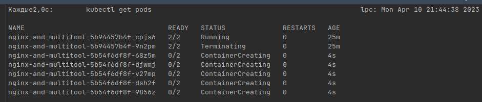
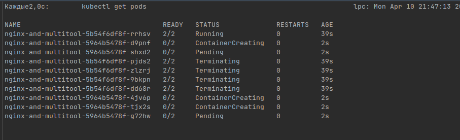
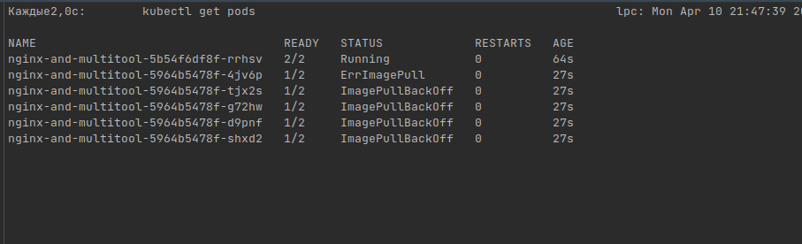
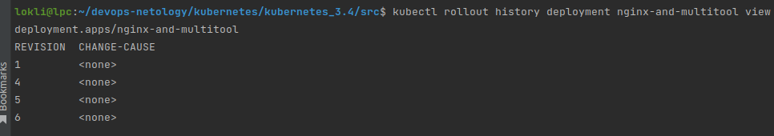
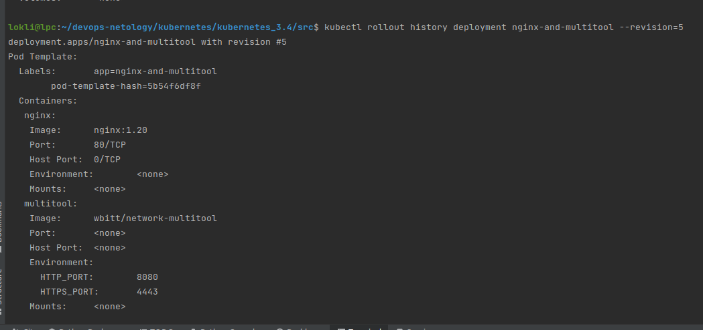
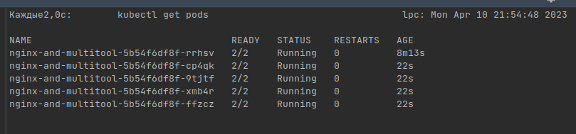
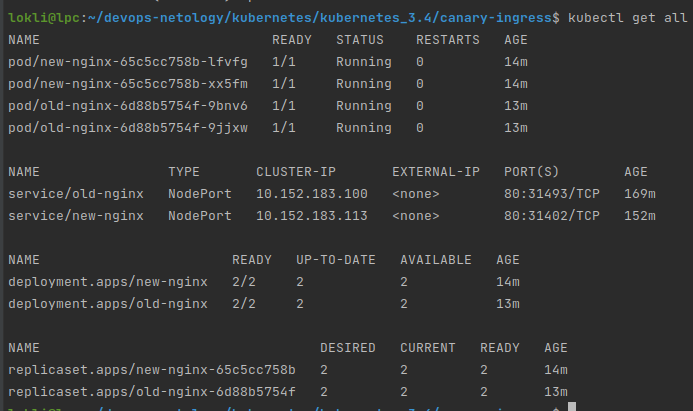
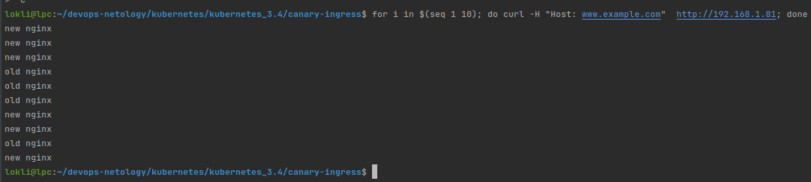

# Домашнее задание к занятию "Обновление приложений"

### Цель задания

Выбрать и настроить стратегию обновления приложения.

### Чеклист готовности к домашнему заданию

1. Кластер k8s.

### Инструменты и дополнительные материалы, которые пригодятся для выполнения задания

1. [Документация Updating a Deployment](https://kubernetes.io/docs/concepts/workloads/controllers/deployment/#updating-a-deployment)
2. [Статья про стратегии обновлений](https://habr.com/ru/companies/flant/articles/471620/)

-----

### Задание 1. Выбрать стратегию обновления приложения и описать ваш выбор.

1. Имеется приложение, состоящее из нескольких реплик, которое требуется обновить.
2. Ресурсы, выделенные для приложения ограничены, и нет возможности их увеличить.
3. Запас по ресурсам в менее загруженный момент времени составляет 20%.
4. Обновление мажорное, новые версии приложения не умеют работать со старыми.
5. Какую стратегию обновления выберете и почему?

> В связи с тем, что ресурсы крайне ограничены и в приложении всего 2 реплики (пару, но даже если допустить 3 - логика изменится не сильно), запас по ресурсам всего 20% в моменты наименьшей загрузки - не получится использовать метод обновления приложения Rolling update, потому что для его применения нужно выделить хотя бы одну реплику для начала обновления приложени ( 1 реплика - 50% ( в случае 3 реплик в приложении - 33%) вычислитеных ресурсов). К тому же версии мажорные - постепенно подменять их нет смысла из-за их не совместимости. 
> 
> Метод обновления приложения Blue/Green так же не подходит, т.к. запас по вычислительным ресурсам должен быть равен 100%. 
> 
> Канареечный метод обновления (и метод A/B тестирования) приложения не подходит так же, как и метод Rolling Update - требуется много ресурсов, которых нет. 
>
> На мой взгляд в данной ситуации подходит только метод обновления Recreate, т.к. на уже выделенных ресурсах он сначала удалит старую версию приложения, затем развернет новую версию приложени (мажорность версии не влияет не на что). 
> 
> К сожалению данный метод имеет свои существенные недостатки (время "недоступности" приложения, требуемое для удаления/разворачивания приложения и "затягивание простоя" в случае сбоя при установке), но в рамках текущей задачи, на мой взгляд, это единственный подходящий метод обновления приложения.
> 
### Задание 2. Обновить приложение.

1. Создать deployment приложения с контейнерами nginx и multitool. Версию nginx взять 1.19. Кол-во реплик - 5.
> [deployment.yaml](src/3-4-nginx_multitool.yaml)
2. Обновить версию nginx в приложении до версии 1.20, сократив время обновления до минимума. Приложение должно быть доступно.
>Для обновление выбрал стратегию RollingUpdate. Для ускорения обновления приложения необходимо увеличить максимально возможно ресурсы, потребляемые сверх "штатной" работы приложения (если позволяет возможность) (maxSurge: 80%) и минимизировать количество рабочих реплик (но не менее 1) ( maxUnavailable: 80%).
> 
> Обновление с 1.19 до 1.20
> 
3. Попытаться обновить nginx до версии 1.28, приложение должно оставаться доступным.
> 
>
> Во время обновления приложения "что-то пошло не так (нет образа с версией 1.28)":
> 
> 
4. Откатиться после неудачного обновления.
> Перед откатом к нужной версии следует посмотреть конфигурации, куда откатываться: 
> 
> 
> 
> 
> 
> Откатываемся: 
> 
> 
> 
> Result: 
> 
> 

## Дополнительные задания (со звездочкой*)

**Настоятельно рекомендуем выполнять все задания под звёздочкой.**   Их выполнение поможет глубже разобраться в материале.   
Задания под звёздочкой дополнительные (необязательные к выполнению) и никак не повлияют на получение вами зачета по этому домашнему заданию. 

### Задание 3*. Создать Canary deployment.

1. Создать 2 deployment'а приложения nginx.
> [ old nginx deployment](canary-ingress/old-nginx.yaml)
>
> [ new nginx deployment](canary-ingress/new-nginx.yaml)
2. При помощи разных ConfigMap сделать 2 версии приложения (веб-страницы).
> ConfigMap в тех же yaml. Для демонстрации "облегчил", чтобы было наглядней сколько раз куда перенаправлен запрос. 
3. С помощью ingress создать канареечный деплоймент, чтобы можно было часть трафика перебросить на разные версии приложения.
> [ingress](canary-ingress/ingress.yaml)
> 
> [canary ingress](canary-ingress/canary-ingress.yaml)
> 
> Для наглядной демонстрации 50% запросов перенаправляется на "канареечный" деплоймент с новой версией nginx.
> 
> Демонстрация:
> 
> 
> 

