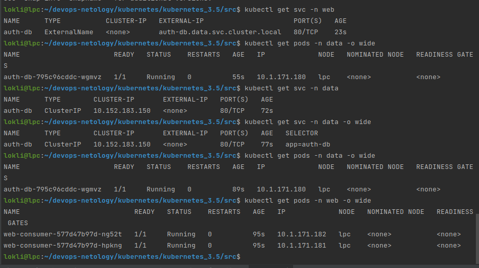
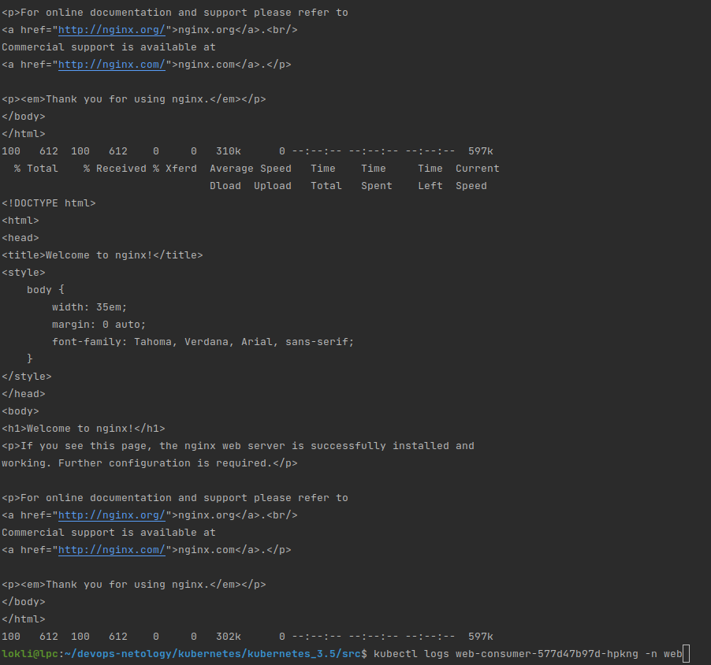

# Домашнее задание к занятию "Troubleshooting"

### Цель задания

Устранить неисправности при деплое приложения.

### Чеклист готовности к домашнему заданию

1. Кластер k8s.

### Задание. При деплое приложение web-consumer не может подключиться к auth-db. Необходимо это исправить.

1. Установить приложение по команде:
```shell
kubectl apply -f https://raw.githubusercontent.com/netology-code/kuber-homeworks/main/3.5/files/task.yaml
```
2. Выявить проблему и описать.
> Основная проблема в том, что приложения находятся в разных неймспейсах и не видят друг-друга.
> 
> Web-consumer в namespace "web", auth-db в namespace "data".
> 
> 
3. Исправить проблему, описать, что сделано.
> Для исправления проблемы можно поменять namespace в одном и  приложений (все сделать в namespace data или в namespace web). 
> 
> Либо в namespace web создать дополнительный сервис, ссылающийся на сервис auth-db: 
> 
```yaml
apiVersion: v1
kind: Service
metadata:
  name: auth-db
  namespace: web
spec:
  type: ExternalName
  externalName: auth-db.data.svc.cluster.local
  ports:
  - port: 80
    protocol: TCP
    targetPort: 80
  selector:
    app: auth-db
```
> Ну и можно навести косметические правки, т.к. удобнее читать сначала о образе и имени контейнера, а потом команды, которые в нем должны выполняться (хотя это на выполнение не влияет):
```yaml
      - image: radial/busyboxplus:curl
        name: busybox
        command:
        - sh
        - -c
        - while true; do curl auth-db; sleep 5; done
``` 

4. Продемонстрировать, что проблема решена.
> После запуса исправленного приложения получаем набор ресурсов: 
> 
> 
> 
> Для демонстрации необходимо продемонстрировать логи пода web-consumer в namespace web командой: 
```shell
kubectl logs web-consumer-577d47b97d-hpkng -n web
```
> 
> 
> Как видно из скриншота логов - в поде циклично запрашивается страница nginx из пода auth-db. 
> 
> 