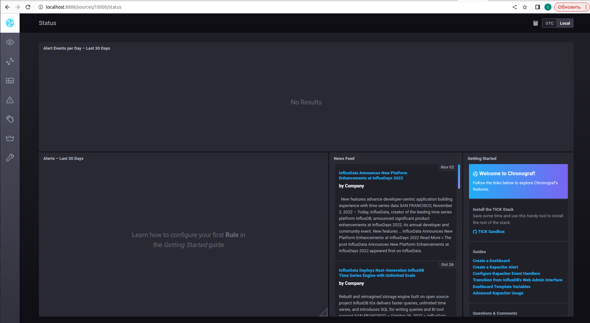
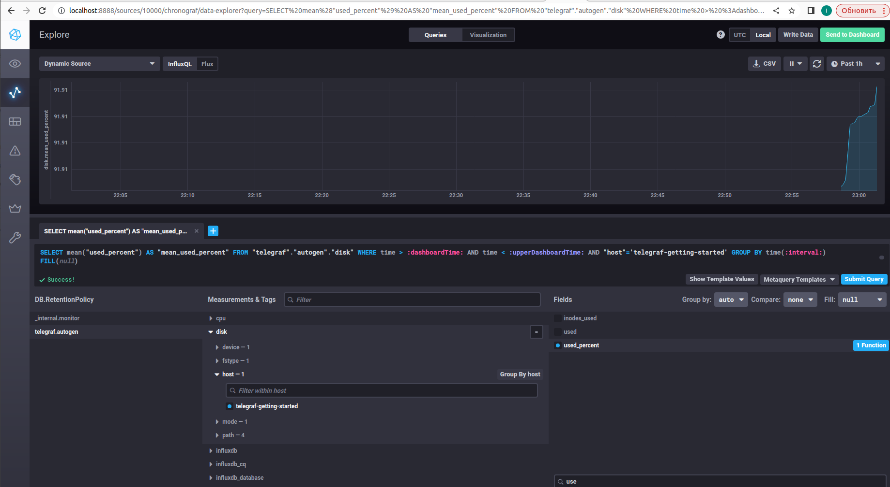
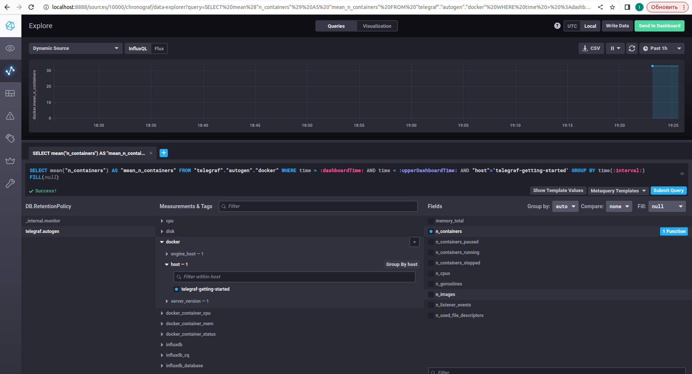

# Домашнее задание к занятию "10.02. Системы мониторинга"

## Обязательные задания

1. Опишите основные плюсы и минусы pull и push систем мониторинга.
> **Pull-системы мониторинга**
>
> Плюсы: 
> 
> Легче контролировать подлинность данных (Гарантия опроса только настроенных агентов и метрик).
> 
> Есть возможность настройки единого Proxy-сервера до агентов с TLS.
> 
> Проще производить отладку полученных данных в связи с тем, что агенты отдают данные по HTTP - можно эти данные запрашивать используя ПО вне системы мониторинга.
> 
> 
> Минусы:
> 
> Система мониторинга должна иметь перечень опрашиваемых систем, что затруднено при динамически создаваемых машинах (докер-контейнеры, виртуальные машины). Решаемо использованием оркестратора.
> 

> 
> 
> **Push-системы мониторинга**
>
> Плюсы: 
> 
> Упрощение репликации данных в разные системы (настраивается на клиенте).
> 
> Гибкая настройка отправки метрик (набор и частота отправки).
> 
> Т.К. в основном для отправки используется UDP - менее затратно по ресурсам.
> 
> Минусы:
> 
> Нет гарантии доставки (в случае проблем на сервере мониторинга метрики "потеряются").
> 
> При динамически разворачиваемых окружениях легко настроить отправку метрик с машин (при запуске клиенты сами отправляют метрики в соответствии на стройками на указанный(е) сервер(а)).
> 

2. Какие из ниже перечисленных систем относятся к push модели, а какие к pull? А может есть гибридные?

    - Prometheus - pull модель мониторинга. 
    - TICK - push модель мониторинга. 
    - Zabbix - Гибридная модель мониторинга (активные проверки - push модель, пассивные проверки - pull модель). 
    - VictoriaMetrics - Гибридная модель мониторинга (Может push, может pull, можно настроить vmagent, который будет опрашивать агентов и пушить метрики на сервер мониторинга.)
    - Nagios - анлогично zabbix - гибридная модель (Активные и пассивные проверки)

3. Склонируйте себе [репозиторий](https://github.com/influxdata/sandbox/tree/master) и запустите TICK-стэк, 
используя технологии docker и docker-compose.

В виде решения на это упражнение приведите выводы команд с вашего компьютера (виртуальной машины):

    - curl http://localhost:8086/ping
    - curl http://localhost:8888
    - curl http://localhost:9092/kapacitor/v1/ping

> `curl http://localhost:8086/ping` не возвращает ничего, информативней с ключем -I. 
> Согласно документации - [он ничего и не должен возвращать, кроме кода 204](https://docs.influxdata.com/kapacitor/v1.6/working/api/#ping)

```shell
curl -I http://localhost:8086/ping                                                                                                                                                                ✔ 
HTTP/1.1 204 No Content
Content-Type: application/json
Request-Id: b4d62fb1-6064-11ed-8137-0242ac140003
X-Influxdb-Build: OSS
X-Influxdb-Version: 1.8.10
X-Request-Id: b4d62fb1-6064-11ed-8137-0242ac140003
Date: Wed, 09 Nov 2022 19:28:36 GMT


```

```shell
$: curl http://localhost:8888                                                                                                                                                                        ✔ 
<!DOCTYPE html><html><head><link rel="stylesheet" href="/index.c708214f.css"><meta http-equiv="Content-type" content="text/html; charset=utf-8"><title>Chronograf</title><link rel="icon shortcut" href="/favicon.70d63073.ico"></head><body> <div id="react-root" data-basepath=""></div> <script type="module" src="/index.e81b88ee.js"></script><script src="/index.a6955a67.js" nomodule="" defer></script> </body></html>%  
```

> `curl http://localhost:9092/kapacitor/v1/ping` не возвращает ничего, информативней с ключем -I. 
> Согласно документации - [он ничего и не должен возвращать, кроме кода 204](https://docs.influxdata.com/kapacitor/v1.6/working/api/#ping). 
```shell
curl -I http://localhost:9092/kapacitor/v1/ping                                                                                                                                                   ✔ 
HTTP/1.1 204 No Content
Content-Type: application/json; charset=utf-8
Request-Id: f3372562-6063-11ed-80d5-0242ac140004
X-Kapacitor-Version: 1.6.5
Date: Wed, 09 Nov 2022 19:23:11 GMT
```


А также скриншот веб-интерфейса ПО chronograf (`http://localhost:8888`). 





P.S.: если при запуске некоторые контейнеры будут падать с ошибкой - проставьте им режим `Z`, например
`./data:/var/lib:Z`

4. Изучите список [telegraf inputs](https://github.com/influxdata/telegraf/tree/master/plugins/inputs).
    - Добавьте в конфигурацию telegraf плагин - [disk](https://github.com/influxdata/telegraf/tree/master/plugins/inputs/disk):
    ```
    [[inputs.disk]]
      ignore_fs = ["tmpfs", "devtmpfs", "devfs", "iso9660", "overlay", "aufs", "squashfs"]
    ```
    - Так же добавьте в конфигурацию telegraf плагин - [mem](https://github.com/influxdata/telegraf/tree/master/plugins/inputs/mem):
    ```
    [[inputs.mem]]
    ```
    - После настройки перезапустите telegraf.
 
    - Перейдите в веб-интерфейс Chronograf (`http://localhost:8888`) и откройте вкладку `Data explorer`.
    - Нажмите на кнопку `Add a query`
    - Изучите вывод интерфейса и выберите БД `telegraf.autogen`
    - В `measurments` выберите mem->host->telegraf_container_id , а в `fields` выберите used_percent. 
    Внизу появится график утилизации оперативной памяти в контейнере telegraf.
    - Вверху вы можете увидеть запрос, аналогичный SQL-синтаксису. 
    Поэкспериментируйте с запросом, попробуйте изменить группировку и интервал наблюдений.
    - Приведите скриншот с отображением
    метрик утилизации места на диске (disk->host->telegraf_container_id) из веб-интерфейса.  

> 
> 
> 
5. Добавьте в конфигурацию telegraf следующий плагин - [docker](https://github.com/influxdata/telegraf/tree/master/plugins/inputs/docker):
```
[[inputs.docker]]
  endpoint = "unix:///var/run/docker.sock"
```

Дополнительно вам может потребоваться донастройка контейнера telegraf в `docker-compose.yml` дополнительного volume и 
режима privileged:
```
  telegraf:
    image: telegraf:1.4.0
    privileged: true
    volumes:
      - ./etc/telegraf.conf:/etc/telegraf/telegraf.conf:Z
      - /var/run/docker.sock:/var/run/docker.sock:Z
    links:
      - influxdb
    ports:
      - "8092:8092/udp"
      - "8094:8094"
      - "8125:8125/udp"
```

После настройки перезапустите telegraf, обновите веб интерфейс и приведите скриншотом список `measurments` в 
веб-интерфейсе базы telegraf.autogen . Там должны появиться метрики, связанные с docker.



Факультативно можете изучить какие метрики собирает telegraf после выполнения данного задания.

## Дополнительное задание (со звездочкой*) - необязательно к выполнению

В веб-интерфейсе откройте вкладку `Dashboards`. Попробуйте создать свой dashboard с отображением:

    - утилизации ЦПУ
    - количества использованного RAM
    - утилизации пространства на дисках
    - количество поднятых контейнеров
    - аптайм
    - ...
    - фантазируйте)
    
    ---

### Как оформить ДЗ?

Выполненное домашнее задание пришлите ссылкой на .md-файл в вашем репозитории.

---
