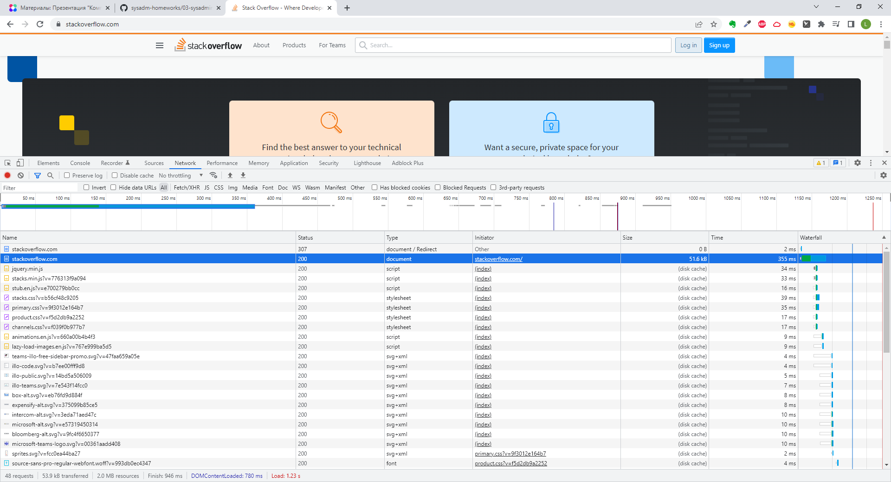

## Домашняя работа к занятию "3.6. Компьютерные сети, лекция 1"

1. 
```
$telnet stackoverflow.com 80
Trying 151.101.129.69...
Connected to stackoverflow.com.
Escape character is '^]'.
GET /questions HTTP/1.0         #Запрашиваем содержимое директории /questions по протоколу HTTP/1.0 
HOST: stackoverflow.com         # c хоста stackoverflow.com

HTTP/1.1 301 Moved Permanently      # код ответа сервера о постоянном перемещении и использованиии протокола HTTP/1.1
cache-control: no-cache, no-store, must-revalidate      # Дальше идут заголовки (ключ : значение)
location: https://stackoverflow.com/questions           
x-request-guid: e136974a-31f8-4888-a496-1d8a11278f1a
feature-policy: microphone 'none'; speaker 'none'
content-security-policy: upgrade-insecure-requests; frame-ancestors 'self' https://stackexchange.com
Accept-Ranges: bytes
Date: Thu, 14 Apr 2022 13:41:29 GMT
Via: 1.1 varnish
Connection: close
X-Served-By: cache-hhn4073-HHN
X-Cache: MISS
X-Cache-Hits: 0
X-Timer: S1649943690.747023,VS0,VE86
Vary: Fastly-SSL
X-DNS-Prefetch-Control: off
Set-Cookie: prov=a5cb3aa0-b987-87f1-6e4f-0fb16376030c; domain=.stackoverflow.com; expires=Fri, 01-Jan-2055 00:00:00 GMT; path=/; HttpOnly
   ```
В комментариях описал что получили в ответ на запрос.

2. 
```
Request URL: http://stackoverflow.com/
Request Method: GET
Status Code: 307 Internal Redirect
Referrer Policy: strict-origin-when-cross-origin
Cross-Origin-Resource-Policy: Cross-Origin
Location: https://stackoverflow.com/
Non-Authoritative-Reason: HSTS
Accept: text/html,application/xhtml+xml,application/xml;q=0.9,image/avif,image/webp,image/apng,*/*;q=0.8,application/signed-exchange;v=b3;q=0.9
DNT: 1
Upgrade-Insecure-Requests: 1
User-Agent: Mozilla/5.0 (Windows NT 10.0; Win64; x64) AppleWebKit/537.36 (KHTML, like Gecko) Chrome/100.0.4896.88 Safari/537.36
```
Дольше всего загружается главная страница ресурса: 

3. 79.111.165.173 

4. 
```
descr:          Net By Net Holding LLC
origin:         AS12714
```
5. Вывод traceroute -An 8.8.8.8:  
 (Первые 5 хопов анонимированы)
Сигнал прошел через AS: AS20****, AS19****, AS49063, AS5480, AS15169
```
 traceroute to 8.8.8.8 (8.8.8.8), 30 hops max, 60 byte packets
 1  *.*.*.*      [*]  56.570 ms  66.043 ms  66.609 ms
 2  *.*.*.*      [*]  87.522 ms  87.775 ms  87.643 ms
 3  *.*.*.*      [*]  88.725 ms  88.613 ms  88.504 ms
 4  *.*.*.*      [*]  88.405 ms  88.314 ms  89.211 ms
 5  *.*.*.*      [AS20****]  88.759 ms  88.640 ms  88.542 ms #
 6  149.126.96.117 [AS19****]  88.447 ms 92.242.39.226 [AS49063]  5.012 ms  4.556 ms
 7  10.200.16.175 [*]  4.415 ms 10.200.16.83 [*]  4.865 ms 10.200.16.220 [*]  4.738 ms
 8  10.200.16.51 [*]  4.611 ms  5.139 ms  5.012 ms
 9  195.208.208.232 [AS5480]  4.887 ms 142.251.237.154 [AS15169]  124.080 ms 72.14.234.20 [AS15169]  27.477 ms
10  108.170.250.113 [AS15169]  25.571 ms 74.125.253.94 [AS15169]  119.084 ms 108.170.250.34 [AS15169]  25.831 ms
11  142.250.56.217 [AS15169]  32.307 ms 216.239.58.69 [AS15169]  28.469 ms 216.239.46.139 [AS15169]  26.807 ms
12  142.251.238.70 [AS15169]  30.341 ms * *
13  216.239.47.173 [AS15169]  28.906 ms 142.250.208.25 [AS15169]  30.103 ms 142.250.236.77 [AS15169]  29.125 ms
14  * * *
15  * * *
16  * * *
17  * * *
18  * * *
19  * * *
20  * * *
21  * * *
22  * *
23  8.8.8.8 [AS15169]  27.415 ms * *

```

6. Наибольшая задержка в строке 13 (Wrst). (Первые 5 хопов анонимированы) 
```
Keys:  Help   Display mode   Restart statistics   Order of fields   quit
                                      Packets               Pings
 Host                               Loss%   Snt   Last   Avg  Best  Wrst StDev
 1. AS???    *.*.*.*                 1.1%   175   35.8  28.4   3.5 417.0  68.8
 2. AS???    *.*.*.*                 0.0%   175    2.3   5.1   2.1  22.9   3.5
 3. AS???    *.*.*.*                 0.6%   175    3.2   5.2   3.2  15.3   2.4
 4. AS???    *.*.*.*                 1.1%   175    2.7   4.6   2.7  17.3   2.6
 5. AS20**** *.*.*.*                 0.0%   175    3.6 103.3   3.1 2202. 374.6
 6. AS49063  92.242.39.226           1.1%   175    3.7 100.7   3.7 2156. 365.2
 7. AS???    10.200.16.79            0.6%   174    4.6  97.0   3.7 2111. 354.3
 8. AS???    10.200.16.156           0.0%   174    4.0 105.3   3.8 2228. 378.6
 9. AS???    195.208.208.232         0.6%   174    4.8 102.3   3.9 2183. 368.3
10. AS15169  108.170.250.34          0.6%   174   26.1 119.2  25.1 2157. 358.0
11. AS15169  142.251.238.82          0.0%   174   32.7 120.5  29.7 2116. 346.4
12. AS15169  142.251.238.72          0.6%   174   30.0 129.0  29.5 2200. 372.1
13. AS15169  172.253.79.169          0.0%   174   28.6 135.5  28.3 2240. 394.1
14. (waiting for reply)
15. (waiting for reply)
16. (waiting for reply)
17. (waiting for reply)
18. (waiting for reply)
19. (waiting for reply)
20. (waiting for reply)
21. (waiting for reply)
22. (waiting for reply)
23. AS15169  8.8.8.8                 0.6%   174   28.9 117.4  28.4 2148. 352.1
```
7. 
```
dig 8.8.8.8 dns.google A

; <<>> DiG 9.16.1-Ubuntu <<>> 8.8.8.8 dns.google A
;; global options: +cmd
;; Got answer:
;; ->>HEADER<<- opcode: QUERY, status: NXDOMAIN, id: 53931
;; flags: qr rd ra; QUERY: 1, ANSWER: 0, AUTHORITY: 0, ADDITIONAL: 1

;; OPT PSEUDOSECTION:
; EDNS: version: 0, flags:; udp: 65494
;; QUESTION SECTION:
;8.8.8.8.                       IN      A

;; Query time: 11 msec
;; SERVER: 127.0.0.53#53(127.0.0.53)
;; WHEN: Mon Apr 18 13:04:36 UTC 2022
;; MSG SIZE  rcvd: 36

;; Got answer:
;; ->>HEADER<<- opcode: QUERY, status: NOERROR, id: 50490
;; flags: qr rd ra; QUERY: 1, ANSWER: 2, AUTHORITY: 0, ADDITIONAL: 1

;; OPT PSEUDOSECTION:
; EDNS: version: 0, flags:; udp: 65494
;; QUESTION SECTION:
;dns.google.                    IN      A

;; ANSWER SECTION:
dns.google.             363     IN      A       8.8.4.4
dns.google.             363     IN      A       8.8.8.8

;; Query time: 3 msec
;; SERVER: 127.0.0.53#53(127.0.0.53)
;; WHEN: Mon Apr 18 13:04:36 UTC 2022
;; MSG SIZE  rcvd: 71

```
За A записи dns.google отвечают сервера: 
dns.google.             363     IN      A       8.8.4.4
dns.google.             363     IN      A       8.8.8.8

8.  8.8.8.8.in-addr.arpa.   81994   IN      PTR     dns.google.
```
dig -x 8.8.8.8

; <<>> DiG 9.16.1-Ubuntu <<>> -x 8.8.8.8
;; global options: +cmd
;; Got answer:
;; ->>HEADER<<- opcode: QUERY, status: NOERROR, id: 32105
;; flags: qr rd ra; QUERY: 1, ANSWER: 1, AUTHORITY: 0, ADDITIONAL: 1

;; OPT PSEUDOSECTION:
; EDNS: version: 0, flags:; udp: 65494
;; QUESTION SECTION:
;8.8.8.8.in-addr.arpa.          IN      PTR

;; ANSWER SECTION:
8.8.8.8.in-addr.arpa.   81994   IN      PTR     dns.google.

;; Query time: 4 msec
;; SERVER: 127.0.0.53#53(127.0.0.53)
;; WHEN: Mon Apr 18 13:15:01 UTC 2022
;; MSG SIZE  rcvd: 73
```
4.4.8.8.in-addr.arpa.   77603   IN      PTR     dns.google.
```
dig -x 8.8.4.4

; <<>> DiG 9.16.1-Ubuntu <<>> -x 8.8.4.4
;; global options: +cmd
;; Got answer:
;; ->>HEADER<<- opcode: QUERY, status: NOERROR, id: 1842
;; flags: qr rd ra; QUERY: 1, ANSWER: 1, AUTHORITY: 0, ADDITIONAL: 1

;; OPT PSEUDOSECTION:
; EDNS: version: 0, flags:; udp: 65494
;; QUESTION SECTION:
;4.4.8.8.in-addr.arpa.          IN      PTR

;; ANSWER SECTION:
4.4.8.8.in-addr.arpa.   77603   IN      PTR     dns.google.

;; Query time: 8 msec
;; SERVER: 127.0.0.53#53(127.0.0.53)
;; WHEN: Mon Apr 18 13:15:26 UTC 2022
;; MSG SIZE  rcvd: 73

```