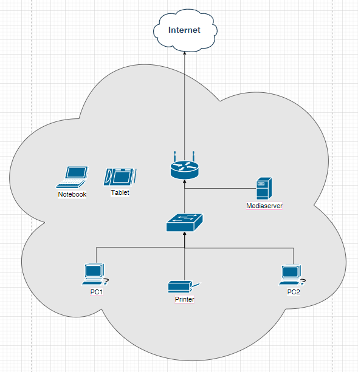

## Домашняя работа к занятию "3.8. Компьютерные сети, лекция 3"

1. 

show  ip route 213.87.155.150


```
route-views>show  ip route 213.87.155.150
Routing entry for 213.87.128.0/19, supernet
  Known via "bgp 6447", distance 20, metric 0
  Tag 2497, type external
  Last update from 202.232.0.2 1d05h ago
  Routing Descriptor Blocks:
  * 202.232.0.2, from 202.232.0.2, 1d05h ago
      Route metric is 0, traffic share count is 1
      AS Hops 2
      Route tag 2497
      MPLS label: none
```

show bgp 213.87.155.150


```
route-views>show bgp 213.87.155.150
BGP routing table entry for 213.87.128.0/19, version 2053112470
Paths: (24 available, best #20, table default)
  Not advertised to any peer
  Refresh Epoch 1
  3333 8359
    193.0.0.56 from 193.0.0.56 (193.0.0.56)
      Origin IGP, localpref 100, valid, external
      Community: 8359:5500 8359:16012 8359:55277
      path 7FE0F19E5DA0 RPKI State valid
      rx pathid: 0, tx pathid: 0
  Refresh Epoch 1
  6939 8359
    64.71.137.241 from 64.71.137.241 (216.218.252.164)
      Origin IGP, localpref 100, valid, external
      path 7FE18202EC38 RPKI State valid
      rx pathid: 0, tx pathid: 0
  Refresh Epoch 1
  101 3356 8359
    209.124.176.223 from 209.124.176.223 (209.124.176.223)
      Origin IGP, localpref 100, valid, external
      Community: 101:20100 101:20110 101:22100 3356:2 3356:22 3356:100 3356:123                                                                                         3356:507 3356:901 3356:2111 8359:5500 8359:16012 8359:55277
      Extended Community: RT:101:22100
      path 7FE0B3E84A28 RPKI State valid
      rx pathid: 0, tx pathid: 0
  Refresh Epoch 1
  8283 8359
    94.142.247.3 from 94.142.247.3 (94.142.247.3)
      Origin IGP, metric 0, localpref 100, valid, external
      Community: 8283:1 8283:101 8283:102 8359:5500 8359:16012 8359:55277
      unknown transitive attribute: flag 0xE0 type 0x20 length 0x24
        value 0000 205B 0000 0000 0000 0001 0000 205B
              0000 0005 0000 0001 0000 205B 0000 0005
              0000 0002
      path 7FE01CE7F198 RPKI State valid
      rx pathid: 0, tx pathid: 0
  Refresh Epoch 1
  53767 174 174 3356 8359
    162.251.163.2 from 162.251.163.2 (162.251.162.3)
      Origin IGP, localpref 100, valid, external
      Community: 174:21000 174:22013 53767:5000
      path 7FE0EA85D9C8 RPKI State valid
      rx pathid: 0, tx pathid: 0
  Refresh Epoch 1
  3267 1299 8359
    194.85.40.15 from 194.85.40.15 (185.141.126.1)
      Origin IGP, metric 0, localpref 100, valid, external
      path 7FE0320A1E00 RPKI State valid
      rx pathid: 0, tx pathid: 0
  Refresh Epoch 1
  3561 3910 3356 8359
    206.24.210.80 from 206.24.210.80 (206.24.210.80)
      Origin IGP, localpref 100, valid, external
      path 7FE1568B4178 RPKI State valid
      rx pathid: 0, tx pathid: 0
  Refresh Epoch 1
  7018 3356 8359
    12.0.1.63 from 12.0.1.63 (12.0.1.63)
      Origin IGP, localpref 100, valid, external
      Community: 7018:5000 7018:37232
      path 7FE04AE80550 RPKI State valid
      rx pathid: 0, tx pathid: 0
  Refresh Epoch 1
  3356 8359
    4.68.4.46 from 4.68.4.46 (4.69.184.201)
      Origin IGP, metric 0, localpref 100, valid, external
      Community: 3356:2 3356:22 3356:100 3356:123 3356:507 3356:901 3356:2111 83                                                                                        59:5500 8359:16012 8359:55277
      path 7FE045D63240 RPKI State valid
      rx pathid: 0, tx pathid: 0
  Refresh Epoch 1
  3549 3356 8359
    208.51.134.254 from 208.51.134.254 (67.16.168.191)
      Origin IGP, metric 0, localpref 100, valid, external
      Community: 3356:2 3356:22 3356:100 3356:123 3356:507 3356:901 3356:2111 35                                                                                        49:2581 3549:30840 8359:5500 8359:16012 8359:55277
      path 7FE0901ABCC8 RPKI State valid
      rx pathid: 0, tx pathid: 0
  Refresh Epoch 1
  701 3356 8359
    137.39.3.55 from 137.39.3.55 (137.39.3.55)
      Origin IGP, localpref 100, valid, external
      path 7FE0CB2D22E8 RPKI State valid
      rx pathid: 0, tx pathid: 0
  Refresh Epoch 1
  19214 3257 3356 8359
    208.74.64.40 from 208.74.64.40 (208.74.64.40)
      Origin IGP, localpref 100, valid, external
      Community: 3257:8108 3257:30048 3257:50002 3257:51200 3257:51203
      path 7FE0862F6FF8 RPKI State valid
      rx pathid: 0, tx pathid: 0
  Refresh Epoch 1
  20130 6939 8359
    140.192.8.16 from 140.192.8.16 (140.192.8.16)
      Origin IGP, localpref 100, valid, external
      path 7FE0A07CCF18 RPKI State valid
      rx pathid: 0, tx pathid: 0
  Refresh Epoch 1
  20912 3257 3356 8359
    212.66.96.126 from 212.66.96.126 (212.66.96.126)
      Origin IGP, localpref 100, valid, external
      Community: 3257:8070 3257:30515 3257:50001 3257:53900 3257:53902 20912:650                                                                                        04
      path 7FE032EB3300 RPKI State valid
      rx pathid: 0, tx pathid: 0
  Refresh Epoch 1
  4901 6079 8359
    162.250.137.254 from 162.250.137.254 (162.250.137.254)
      Origin IGP, localpref 100, valid, external
      Community: 65000:10100 65000:10300 65000:10400
      path 7FE0A855C1C8 RPKI State valid
      rx pathid: 0, tx pathid: 0
  Refresh Epoch 1
  57866 3356 8359
    37.139.139.17 from 37.139.139.17 (37.139.139.17)
      Origin IGP, metric 0, localpref 100, valid, external
      Community: 3356:2 3356:22 3356:100 3356:123 3356:507 3356:901 3356:2111 83                                                                                        59:5500 8359:16012 8359:55277
      path 7FE18B63D988 RPKI State valid
      rx pathid: 0, tx pathid: 0
  Refresh Epoch 1
  852 3356 8359
    154.11.12.212 from 154.11.12.212 (96.1.209.43)
      Origin IGP, metric 0, localpref 100, valid, external
      path 7FE02218FB20 RPKI State valid
      rx pathid: 0, tx pathid: 0
  Refresh Epoch 1
  1351 8359 8359
    132.198.255.253 from 132.198.255.253 (132.198.255.253)
      Origin IGP, localpref 100, valid, external
      path 7FE09DB43ED0 RPKI State valid
      rx pathid: 0, tx pathid: 0
  Refresh Epoch 1
  3303 8359
    217.192.89.50 from 217.192.89.50 (138.187.128.158)
      Origin IGP, localpref 100, valid, external
      Community: 3303:1004 3303:1006 3303:1030 3303:3054 8359:5500 8359:16012 83                                                                                        59:55277
      path 7FE096134318 RPKI State valid
      rx pathid: 0, tx pathid: 0
  Refresh Epoch 2
  2497 8359
    202.232.0.2 from 202.232.0.2 (58.138.96.254)
      Origin IGP, localpref 100, valid, external, best
      path 7FE104C72EA0 RPKI State valid
      rx pathid: 0, tx pathid: 0x0
  Refresh Epoch 1
  7660 2516 1299 8359
    203.181.248.168 from 203.181.248.168 (203.181.248.168)
      Origin IGP, localpref 100, valid, external
      Community: 2516:1030 7660:9001
      path 7FE014C67DF0 RPKI State valid
      rx pathid: 0, tx pathid: 0
  Refresh Epoch 1
  3257 3356 8359
    89.149.178.10 from 89.149.178.10 (213.200.83.26)
      Origin IGP, metric 10, localpref 100, valid, external
      Community: 3257:8794 3257:30043 3257:50001 3257:54900 3257:54901
      path 7FE032F50A68 RPKI State valid
      rx pathid: 0, tx pathid: 0
  Refresh Epoch 1
  49788 12552 8359
    91.218.184.60 from 91.218.184.60 (91.218.184.60)
      Origin IGP, localpref 100, valid, external
      Community: 12552:12000 12552:12100 12552:12101 12552:22000
      Extended Community: 0x43:100:1
      path 7FE156818510 RPKI State valid
      rx pathid: 0, tx pathid: 0
  Refresh Epoch 1
  1221 4637 3356 8359
    203.62.252.83 from 203.62.252.83 (203.62.252.83)
      Origin IGP, localpref 100, valid, external
      path 7FE104BB84F8 RPKI State valid
      rx pathid: 0, tx pathid: 0
route-views>show  ip route 213.87.155.150
Routing entry for 213.87.128.0/19, supernet
  Known via "bgp 6447", distance 20, metric 0
  Tag 2497, type external
  Last update from 202.232.0.2 1d05h ago
  Routing Descriptor Blocks:
  * 202.232.0.2, from 202.232.0.2, 1d05h ago
      Route metric is 0, traffic share count is 1
      AS Hops 2
      Route tag 2497
      MPLS label: none
route-views>show bgp 213.87.155.150
BGP routing table entry for 213.87.128.0/19, version 2053112470
Paths: (24 available, best #20, table default)
  Not advertised to any peer
  Refresh Epoch 1
  3333 8359
    193.0.0.56 from 193.0.0.56 (193.0.0.56)
      Origin IGP, localpref 100, valid, external
      Community: 8359:5500 8359:16012 8359:55277
      path 7FE0F19E5DA0 RPKI State valid
      rx pathid: 0, tx pathid: 0
  Refresh Epoch 1
  6939 8359
    64.71.137.241 from 64.71.137.241 (216.218.252.164)
      Origin IGP, localpref 100, valid, external
      path 7FE18202EC38 RPKI State valid
      rx pathid: 0, tx pathid: 0
  Refresh Epoch 1
  101 3356 8359
    209.124.176.223 from 209.124.176.223 (209.124.176.223)
      Origin IGP, localpref 100, valid, external
      Community: 101:20100 101:20110 101:22100 3356:2 3356:22 3356:100 3356:123                                                                                         3356:507 3356:901 3356:2111 8359:5500 8359:16012 8359:55277
      Extended Community: RT:101:22100
      path 7FE0B3E84A28 RPKI State valid
      rx pathid: 0, tx pathid: 0
  Refresh Epoch 1
  8283 8359
    94.142.247.3 from 94.142.247.3 (94.142.247.3)
      Origin IGP, metric 0, localpref 100, valid, external
      Community: 8283:1 8283:101 8283:102 8359:5500 8359:16012 8359:55277
      unknown transitive attribute: flag 0xE0 type 0x20 length 0x24
        value 0000 205B 0000 0000 0000 0001 0000 205B
              0000 0005 0000 0001 0000 205B 0000 0005
              0000 0002
      path 7FE01CE7F198 RPKI State valid
      rx pathid: 0, tx pathid: 0
  Refresh Epoch 1
  53767 174 174 3356 8359
    162.251.163.2 from 162.251.163.2 (162.251.162.3)
      Origin IGP, localpref 100, valid, external
      Community: 174:21000 174:22013 53767:5000
      path 7FE0EA85D9C8 RPKI State valid
      rx pathid: 0, tx pathid: 0
  Refresh Epoch 1
  3267 1299 8359
    194.85.40.15 from 194.85.40.15 (185.141.126.1)
      Origin IGP, metric 0, localpref 100, valid, external
      path 7FE0320A1E00 RPKI State valid
      rx pathid: 0, tx pathid: 0
  Refresh Epoch 1
  3561 3910 3356 8359
    206.24.210.80 from 206.24.210.80 (206.24.210.80)
      Origin IGP, localpref 100, valid, external
      path 7FE1568B4178 RPKI State valid
      rx pathid: 0, tx pathid: 0
  Refresh Epoch 1
  7018 3356 8359
    12.0.1.63 from 12.0.1.63 (12.0.1.63)
      Origin IGP, localpref 100, valid, external
      Community: 7018:5000 7018:37232
      path 7FE04AE80550 RPKI State valid
      rx pathid: 0, tx pathid: 0
  Refresh Epoch 1
  3356 8359
    4.68.4.46 from 4.68.4.46 (4.69.184.201)
      Origin IGP, metric 0, localpref 100, valid, external
      Community: 3356:2 3356:22 3356:100 3356:123 3356:507 3356:901 3356:2111 83                                                                                        59:5500 8359:16012 8359:55277
      path 7FE045D63240 RPKI State valid
      rx pathid: 0, tx pathid: 0
  Refresh Epoch 1
  3549 3356 8359
    208.51.134.254 from 208.51.134.254 (67.16.168.191)
      Origin IGP, metric 0, localpref 100, valid, external
      Community: 3356:2 3356:22 3356:100 3356:123 3356:507 3356:901 3356:2111 35                                                                                        49:2581 3549:30840 8359:5500 8359:16012 8359:55277
      path 7FE0901ABCC8 RPKI State valid
      rx pathid: 0, tx pathid: 0
  Refresh Epoch 1
  701 3356 8359
    137.39.3.55 from 137.39.3.55 (137.39.3.55)
      Origin IGP, localpref 100, valid, external
      path 7FE0CB2D22E8 RPKI State valid
      rx pathid: 0, tx pathid: 0
  Refresh Epoch 1
  19214 3257 3356 8359
    208.74.64.40 from 208.74.64.40 (208.74.64.40)
      Origin IGP, localpref 100, valid, external
      Community: 3257:8108 3257:30048 3257:50002 3257:51200 3257:51203
      path 7FE0862F6FF8 RPKI State valid
      rx pathid: 0, tx pathid: 0
  Refresh Epoch 1
  20130 6939 8359
    140.192.8.16 from 140.192.8.16 (140.192.8.16)
      Origin IGP, localpref 100, valid, external
      path 7FE0A07CCF18 RPKI State valid
      rx pathid: 0, tx pathid: 0
  Refresh Epoch 1
  20912 3257 3356 8359
    212.66.96.126 from 212.66.96.126 (212.66.96.126)
      Origin IGP, localpref 100, valid, external
      Community: 3257:8070 3257:30515 3257:50001 3257:53900 3257:53902 20912:650                                                                                        04
      path 7FE032EB3300 RPKI State valid
      rx pathid: 0, tx pathid: 0
  Refresh Epoch 1
  4901 6079 8359
    162.250.137.254 from 162.250.137.254 (162.250.137.254)
      Origin IGP, localpref 100, valid, external
      Community: 65000:10100 65000:10300 65000:10400
      path 7FE0A855C1C8 RPKI State valid
      rx pathid: 0, tx pathid: 0
  Refresh Epoch 1
  57866 3356 8359
    37.139.139.17 from 37.139.139.17 (37.139.139.17)
      Origin IGP, metric 0, localpref 100, valid, external
      Community: 3356:2 3356:22 3356:100 3356:123 3356:507 3356:901 3356:2111 83                                                                                        59:5500 8359:16012 8359:55277
      path 7FE18B63D988 RPKI State valid
      rx pathid: 0, tx pathid: 0
  Refresh Epoch 1
  852 3356 8359
    154.11.12.212 from 154.11.12.212 (96.1.209.43)
      Origin IGP, metric 0, localpref 100, valid, external
      path 7FE02218FB20 RPKI State valid
      rx pathid: 0, tx pathid: 0
  Refresh Epoch 1
  1351 8359 8359
    132.198.255.253 from 132.198.255.253 (132.198.255.253)
      Origin IGP, localpref 100, valid, external
      path 7FE09DB43ED0 RPKI State valid
      rx pathid: 0, tx pathid: 0
  Refresh Epoch 1
  3303 8359
    217.192.89.50 from 217.192.89.50 (138.187.128.158)
      Origin IGP, localpref 100, valid, external
      Community: 3303:1004 3303:1006 3303:1030 3303:3054 8359:5500 8359:16012 83                                                                                        59:55277
      path 7FE096134318 RPKI State valid
      rx pathid: 0, tx pathid: 0
  Refresh Epoch 2
  2497 8359
    202.232.0.2 from 202.232.0.2 (58.138.96.254)
      Origin IGP, localpref 100, valid, external, best
      path 7FE104C72EA0 RPKI State valid
      rx pathid: 0, tx pathid: 0x0
  Refresh Epoch 1
  7660 2516 1299 8359
    203.181.248.168 from 203.181.248.168 (203.181.248.168)
      Origin IGP, localpref 100, valid, external
      Community: 2516:1030 7660:9001
      path 7FE014C67DF0 RPKI State valid
      rx pathid: 0, tx pathid: 0
  Refresh Epoch 1
  3257 3356 8359
    89.149.178.10 from 89.149.178.10 (213.200.83.26)
      Origin IGP, metric 10, localpref 100, valid, external
      Community: 3257:8794 3257:30043 3257:50001 3257:54900 3257:54901
      path 7FE032F50A68 RPKI State valid
      rx pathid: 0, tx pathid: 0
  Refresh Epoch 1
  49788 12552 8359
    91.218.184.60 from 91.218.184.60 (91.218.184.60)
      Origin IGP, localpref 100, valid, external
      Community: 12552:12000 12552:12100 12552:12101 12552:22000
      Extended Community: 0x43:100:1
      path 7FE156818510 RPKI State valid
      rx pathid: 0, tx pathid: 0
  Refresh Epoch 1
  1221 4637 3356 8359
    203.62.252.83 from 203.62.252.83 (203.62.252.83)
      Origin IGP, localpref 100, valid, external
      path 7FE104BB84F8 RPKI State valid
      rx pathid: 0, tx pathid: 0
```
2. 
Создание интерфейса: 

``` user@linux1:~$ sudo ip link add name dummy0 type dummy
[sudo] password for user:
user@linux1:~$ sudo ip link set dummy0 up
user@linux1:~$ sudo ip address add 172.16.11.1 dev dummy0
user@linux1:~$ ip -c -br a
lo               UNKNOWN        127.0.0.1/8 ::1/128
ens3             UP
ens4             UP
ens5             UP             10.16.114.242/24 fe80::250:ff:fe00:102/64
bond0            UP             192.168.250.13/24 fe80::405c:32ff:fe1a:7350/64
dummy0           UNKNOWN        172.16.11.1/32 fe80::945e:51ff:feb7:b404/64
user@linux1:~$ ping 172.16.11.1
PING 172.16.11.1 (172.16.11.1) 56(84) bytes of data.
64 bytes from 172.16.11.1: icmp_seq=1 ttl=64 time=0.060 ms
^C
--- 172.16.11.1 ping statistics ---
1 packets transmitted, 1 received, 0% packet loss, time 0ms
rtt min/avg/max/mdev = 0.060/0.060/0.060/0.000 ms 
```
Статические маршруты (без добавления статического маршрута сеть 192.168.255.0/24 не пингуется на стенде): 

```
user@linux1:~$ sudo ip route add 192.168.255.0/24 dev bond0
user@linux1:~$ ip route sh
default via 10.16.114.254 dev ens5 proto dhcp src 10.16.114.242 metric 100
10.16.114.0/24 dev ens5 proto kernel scope link src 10.16.114.242
10.16.114.254 dev ens5 proto dhcp scope link src 10.16.114.242 metric 100
192.168.250.0/24 dev bond0 proto kernel scope link src 192.168.250.13
192.168.255.0/24 dev bond0 scope link
user@linux1:~$ ping 192.168.255.1
PING 192.168.255.1 (192.168.255.1) 56(84) bytes of data.
64 bytes from 192.168.255.1: icmp_seq=1 ttl=64 time=1.78 ms
^C
--- 192.168.255.1 ping statistics ---
1 packets transmitted, 1 received, 0% packet loss, time 0ms
rtt min/avg/max/mdev = 1.778/1.778/1.778/0.000 ms

```


3. 
```
user@linux1:~$ ss -lt
State      Recv-Q     Send-Q          Local Address:Port             Peer Address:Port     Process
LISTEN     0          4096            127.0.0.53%lo:domain                0.0.0.0:*
LISTEN     0          128                   0.0.0.0:ssh                   0.0.0.0:*
LISTEN     0          128                      [::]:ssh                      [::]:*
```
ssh порт используется для установки ssh - соединения. В данном случае отображены только "слушающие" порты TCP. 
Если отобразить подключенные в том числе - выглядеть будет так: 

``` 

user@linux1:~$ ss -l -t -a
State                   Recv-Q                   Send-Q                                     Local Address:Port                                       Peer Address:Port                   Process
LISTEN                  0                        4096                                       127.0.0.53%lo:domain                                          0.0.0.0:*
LISTEN                  0                        128                                              0.0.0.0:ssh                                             0.0.0.0:*
ESTAB                   0                        36                                         10.16.114.242:ssh                                         10.16.114.1:50530
LISTEN                  0                        128                                                 [::]:ssh                                                [::]:*

```
127.0.0.53%lo:domain - DNS ubuntu по-умолчанию - тоже порт открыт в режиме "прослушки".


4. 
```
 ss -l -u
State                   Recv-Q                  Send-Q                                        Local Address:Port                                      Peer Address:Port                  Process
UNCONN                  0                       0                                             127.0.0.53%lo:domain                                         0.0.0.0:*
UNCONN                  0                       0                                        10.16.114.242%ens5:bootpc                                         0.0.0.0:*

```
10.16.114.242%ens5:bootpc порт используется DHCP для получения ip адреса по 68 порту для интерфейса ens5. 
127.0.0.53%lo:domain - DNS ubuntu по-умолчанию - тоже порт открыт в режиме "прослушки".

5. Диаграмма домашней сети:  

6. Сделано: 
/etc/nginx/nginx.conf
```
user www-data;
worker_processes auto;
pid /run/nginx.pid;
include /etc/nginx/modules-enabled/*.conf;

events {
        worker_connections 768;
}

stream {
        upstream dns_backend {
                server 8.8.8.8:53;
                server 8.8.4.4:53;
        }
        server {
                listen 53 udp;
                proxy_pass dns_backend;
                proxy_responses 1;
                }
        upstream tcp_backend {
                server 192.168.0.3:3306;
                server 192.168.0.4:3306;
        }
        server {
                listen 3306;
                proxy_pass tcp_backend;
        }
}
http {

        sendfile on;
        tcp_nopush on;
        tcp_nodelay on;
        keepalive_timeout 65;
        types_hash_max_size 2048;
        server_names_hash_bucket_size 64;
        include /etc/nginx/mime.types;
        default_type application/octet-stream;
        ssl_protocols TLSv1 TLSv1.1 TLSv1.2 TLSv1.3; # Dropping SSLv3, ref: POODLE
        access_log /var/log/nginx/access.log;
        error_log /var/log/nginx/error.log;
        gzip on;
        include /etc/nginx/conf.d/*.conf;
        include /etc/nginx/sites-enabled/*;
        upstream backend1 {
                server 192.168.0.3;
                server 192.168.0.4;
        }

}
```
7. 

ubuntu 1
``` 
log syslog all;
protocol device {
}
protocol direct {
        ipv4;
        interface "dummy0";                     # Connect to default IPv4 table
}
protocol kernel {
        ipv4 {                  # Connect protocol to IPv4 table by channel
              export all;       # Export to protocol. default is export none
        };
}
protocol kernel {
        ipv6 { export all; };
}
protocol static {
        ipv4;                   # Again, IPv4 channel with default options
}
protocol rip {
        ipv4 {
                import all;
                export where source ~ [ RTS_DEVICE, RTS_STATIC, RTS_RIP ];
        };
        interface "ens3"; #{
 }
```


ubuntu 2
``` 
log syslog all;
protocol device {
}
protocol direct {
        ipv4;
        interface "dummy0";                     # Connect to default IPv4 table
}
protocol kernel {
        ipv4 {                  # Connect protocol to IPv4 table by channel
              export all;       # Export to protocol. default is export none
        };
}
protocol kernel {
        ipv6 { export all; };
}
protocol static {
        ipv4;                   # Again, IPv4 channel with default options
}
protocol rip {
        ipv4 {
                import all;
                export where source ~ [ RTS_DEVICE, RTS_STATIC, RTS_RIP ];
        };
        interface "ens3"; #{
 }
```


``` 

user@nginx-1:~$ ip -br r
default via 192.168.0.1 dev ens3 proto static
10.10.10.1 dev dummy0 proto bird scope link metric 32
10.20.20.2 via 192.168.0.3 dev ens3 proto bird metric 32
192.168.0.0/24 dev ens3 proto kernel scope link src 192.168.0.2

```


``` 
 ip -br r
default via 192.168.0.1 dev ens3 proto static
10.10.10.1 via 192.168.0.2 dev ens3 proto bird metric 32
10.20.20.2 dev dummy0 proto bird scope link metric 32
192.168.0.0/24 dev ens3 proto kernel scope link src 192.168.0.3
```


