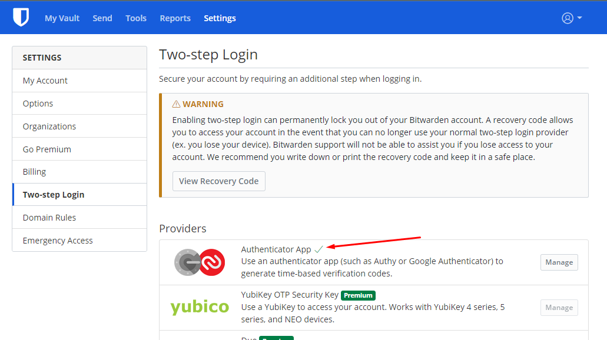
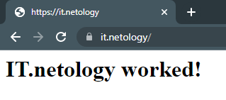
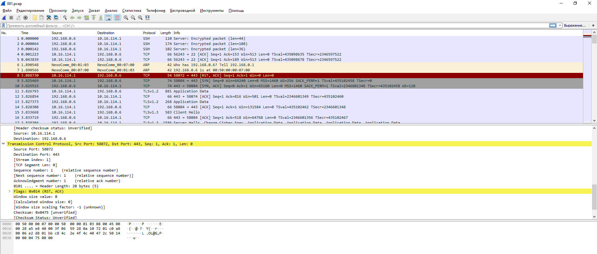

## Домашняя работа к занятию "3.9. Элементы безопасности информационных систем"

1. Сделано.
2. Сделано: 
3. Сделано: 
4. Протестирован https://www.mail.ru: 


``` 
user@linux1:~/testssl.sh$ ./testssl.sh -U --sneaky https://www.mail.ru/

###########################################################
    testssl.sh       3.1dev from https://testssl.sh/dev/
    (859da96 2022-05-04 10:48:18)

      This program is free software. Distribution and
             modification under GPLv2 permitted.
      USAGE w/o ANY WARRANTY. USE IT AT YOUR OWN RISK!

       Please file bugs @ https://testssl.sh/bugs/

###########################################################

 Using "OpenSSL 1.0.2-chacha (1.0.2k-dev)" [~183 ciphers]
 on linux1:./bin/openssl.Linux.x86_64
 (built: "Jan 18 17:12:17 2019", platform: "linux-x86_64")


Testing all IPv4 addresses (port 443): 94.100.180.70 217.69.139.70
--------------------------------------------------------------------
 Start 2022-05-04 08:58:19        -->> 94.100.180.70:443 (www.mail.ru) <<--

 Further IP addresses:   217.69.139.70
 rDNS (94.100.180.70):   www.mail.ru.
 Service detected:       HTTP


 Testing vulnerabilities

 Heartbleed (CVE-2014-0160)                not vulnerable (OK), timed out
 CCS (CVE-2014-0224)                       not vulnerable (OK)
 Ticketbleed (CVE-2016-9244), experiment.  test failed, non reproducible results! Please run again w "--debug=2"  (# of faked TLS SIDs detected: 1)
 ROBOT                                     not vulnerable (OK)
 Secure Renegotiation (RFC 5746)           supported (OK)
 Secure Client-Initiated Renegotiation     not vulnerable (OK)
 CRIME, TLS (CVE-2012-4929)                not vulnerable (OK)
 BREACH (CVE-2013-3587)                    no gzip/deflate/compress/br HTTP compression (OK)  - only supplied "/" tested
 POODLE, SSL (CVE-2014-3566)               not vulnerable (OK)
 TLS_FALLBACK_SCSV (RFC 7507)              Downgrade attack prevention supported (OK)
 SWEET32 (CVE-2016-2183, CVE-2016-6329)    VULNERABLE, uses 64 bit block ciphers
 FREAK (CVE-2015-0204)                     not vulnerable (OK)
 DROWN (CVE-2016-0800, CVE-2016-0703)      not vulnerable on this host and port (OK)
                                           make sure you don't use this certificate elsewhere with SSLv2 enabled services
                                           https://censys.io/ipv4?q=FC141215520336C94E96BBD432E44A0D446450D64421BE55D99E760383AAFFE0 could help you to find out
 LOGJAM (CVE-2015-4000), experimental      not vulnerable (OK): no DH EXPORT ciphers, no common prime detected
 BEAST (CVE-2011-3389)                     TLS1: ECDHE-RSA-AES256-SHA ECDHE-RSA-AES128-SHA
                                                 ECDHE-RSA-DES-CBC3-SHA DHE-RSA-AES256-SHA
                                                 DHE-RSA-CAMELLIA256-SHA DHE-RSA-AES128-SHA
                                                 DHE-RSA-SEED-SHA DHE-RSA-CAMELLIA128-SHA
                                                 EDH-RSA-DES-CBC3-SHA AES256-SHA CAMELLIA256-SHA
                                                 AES128-SHA CAMELLIA128-SHA DES-CBC3-SHA SEED-SHA
                                           VULNERABLE -- but also supports higher protocols  TLSv1.1 TLSv1.2 (likely mitigated)
 LUCKY13 (CVE-2013-0169), experimental     potentially VULNERABLE, uses cipher block chaining (CBC) ciphers with TLS. Check patches
 Winshock (CVE-2014-6321), experimental    not vulnerable (OK) - CAMELLIA or ECDHE_RSA GCM ciphers found
 RC4 (CVE-2013-2566, CVE-2015-2808)        no RC4 ciphers detected (OK)


 Done 2022-05-04 08:59:03 [  46s] -->> 94.100.180.70:443 (www.mail.ru) <<--

--------------------------------------------------------------------
 Start 2022-05-04 08:59:03        -->> 217.69.139.70:443 (www.mail.ru) <<--

 Further IP addresses:   94.100.180.70
 rDNS (217.69.139.70):   www.mail.ru.
 Service detected:       HTTP


 Testing vulnerabilities

 Heartbleed (CVE-2014-0160)                not vulnerable (OK), timed out
 CCS (CVE-2014-0224)                       not vulnerable (OK)
 Ticketbleed (CVE-2016-9244), experiment.  test failed, non reproducible results! Please run again w "--debug=2"  (# of faked TLS SIDs detected: 0)
 ROBOT                                     not vulnerable (OK)
 Secure Renegotiation (RFC 5746)           supported (OK)
 Secure Client-Initiated Renegotiation     not vulnerable (OK)
 CRIME, TLS (CVE-2012-4929)                not vulnerable (OK)
 BREACH (CVE-2013-3587)                    no gzip/deflate/compress/br HTTP compression (OK)  - only supplied "/" tested
 POODLE, SSL (CVE-2014-3566)               not vulnerable (OK)
 TLS_FALLBACK_SCSV (RFC 7507)              Downgrade attack prevention supported (OK)
 SWEET32 (CVE-2016-2183, CVE-2016-6329)    VULNERABLE, uses 64 bit block ciphers
 FREAK (CVE-2015-0204)                     not vulnerable (OK)
 DROWN (CVE-2016-0800, CVE-2016-0703)      not vulnerable on this host and port (OK)
                                           make sure you don't use this certificate elsewhere with SSLv2 enabled services
                                           https://censys.io/ipv4?q=FC141215520336C94E96BBD432E44A0D446450D64421BE55D99E760383AAFFE0 could help you to find out
 LOGJAM (CVE-2015-4000), experimental      not vulnerable (OK): no DH EXPORT ciphers, no common prime detected
 BEAST (CVE-2011-3389)                     TLS1: ECDHE-RSA-AES256-SHA ECDHE-RSA-AES128-SHA
                                                 ECDHE-RSA-DES-CBC3-SHA DHE-RSA-AES256-SHA
                                                 DHE-RSA-CAMELLIA256-SHA DHE-RSA-AES128-SHA
                                                 DHE-RSA-SEED-SHA DHE-RSA-CAMELLIA128-SHA
                                                 EDH-RSA-DES-CBC3-SHA AES256-SHA CAMELLIA256-SHA
                                                 AES128-SHA CAMELLIA128-SHA DES-CBC3-SHA SEED-SHA
                                           VULNERABLE -- but also supports higher protocols  TLSv1.1 TLSv1.2 (likely mitigated)
 LUCKY13 (CVE-2013-0169), experimental     potentially VULNERABLE, uses cipher block chaining (CBC) ciphers with TLS. Check patches
 Winshock (CVE-2014-6321), experimental    not vulnerable (OK) - CAMELLIA or ECDHE_RSA GCM ciphers found
 RC4 (CVE-2013-2566, CVE-2015-2808)        no RC4 ciphers detected (OK)


 Done 2022-05-04 08:59:49 [  92s] -->> 217.69.139.70:443 (www.mail.ru) <<--

--------------------------------------------------------------------
Done testing now all IP addresses (on port 443): 94.100.180.70 217.69.139.70

```


5. Сгенерировал, подключился по ключу без запроса пароля. 
``` 
ssh-copy-id user@192.168.0.1
/usr/bin/ssh-copy-id: INFO: Source of key(s) to be installed: "/home/user/.ssh/id_rsa.pub"
/usr/bin/ssh-copy-id: INFO: attempting to log in with the new key(s), to filter out any that are already installed
/usr/bin/ssh-copy-id: INFO: 1 key(s) remain to be installed -- if you are prompted now it is to install the new keys
user@192.168.0.1's password:

Number of key(s) added: 1

Now try logging into the machine, with:   "ssh 'user@192.168.0.1'"
and check to make sure that only the key(s) you wanted were added. 

```
6. Сделано. 
``` 
ssh apache-srv
Welcome to Ubuntu 20.04.2 LTS (GNU/Linux 5.4.0-109-generic x86_64)

 * Documentation:  https://help.ubuntu.com
 * Management:     https://landscape.canonical.com
 * Support:        https://ubuntu.com/advantage

  System information as of Wed May  4 11:07:02 UTC 2022

  System load:  0.0               Users logged in:        1
  Usage of /:   53.9% of 8.79GB   
  Memory usage: 42%               
  Swap usage:   0%                IPv4 address for ens6:  192.168.0.1
  Processes:    116

 * Super-optimized for small spaces - read how we shrank the memory
   footprint of MicroK8s to make it the smallest full K8s around.

   https://ubuntu.com/blog/microk8s-memory-optimisation

116 updates can be installed immediately.
2 of these updates are security updates.
To see these additional updates run: apt list --upgradable


Last login: Wed May  4 11:01:43 2022 from 192.168.0.6
```
Конфиг: 
``` 
Host apache-srv
HostName 192.168.0.1
IdentityFile ~/.ssh/apache-srv
User user
```
7. Собрал 100 пакетов командой: ` sudo tcpdump -c 100 -w 001.pcap -i ens3`


Открыл. 



8. 

``` 
nmap -v -A scanme.nmap.org
Starting Nmap 7.80 ( https://nmap.org ) at 2022-05-04 11:25 UTC
NSE: Loaded 151 scripts for scanning.
NSE: Script Pre-scanning.
Initiating NSE at 11:25
Completed NSE at 11:25, 0.00s elapsed
Initiating NSE at 11:25
Completed NSE at 11:25, 0.00s elapsed
Initiating NSE at 11:25
Completed NSE at 11:25, 0.00s elapsed
Initiating Ping Scan at 11:25
Scanning scanme.nmap.org (45.33.32.156) [2 ports]
Completed Ping Scan at 11:25, 0.18s elapsed (1 total hosts)
Initiating Parallel DNS resolution of 1 host. at 11:25
Completed Parallel DNS resolution of 1 host. at 11:25, 0.44s elapsed
Initiating Connect Scan at 11:25
Scanning scanme.nmap.org (45.33.32.156) [1000 ports]
Discovered open port 80/tcp on 45.33.32.156
Discovered open port 8008/tcp on 45.33.32.156
Discovered open port 9929/tcp on 45.33.32.156
Discovered open port 31337/tcp on 45.33.32.156
Completed Connect Scan at 11:26, 16.37s elapsed (1000 total ports)
Initiating Service scan at 11:26
Scanning 4 services on scanme.nmap.org (45.33.32.156)
Completed Service scan at 11:28, 139.02s elapsed (4 services on 1 host)
NSE: Script scanning 45.33.32.156.
Initiating NSE at 11:28
Completed NSE at 11:28, 14.18s elapsed
Initiating NSE at 11:28
Completed NSE at 11:28, 1.13s elapsed
Initiating NSE at 11:28
Completed NSE at 11:28, 0.00s elapsed
Nmap scan report for scanme.nmap.org (45.33.32.156)
Host is up (0.18s latency).
Other addresses for scanme.nmap.org (not scanned): 2600:3c01::f03c:91ff:fe18:bb2f
Not shown: 994 filtered ports
PORT      STATE  SERVICE    VERSION
80/tcp    open   http       Apache httpd 2.4.7 ((Ubuntu))
|_http-favicon: Unknown favicon MD5: 156515DA3C0F7DC6B2493BD5CE43F795
| http-methods:
|_  Supported Methods: GET HEAD POST OPTIONS
|_http-server-header: Apache/2.4.7 (Ubuntu)
|_http-title: Go ahead and ScanMe!
113/tcp   closed ident
8008/tcp  open   http
| fingerprint-strings:
|   FourOhFourRequest:
|     HTTP/1.1 302 Found
|     Location: https://:8015/nice%20ports%2C/Tri%6Eity.txt%2ebak
|     Connection: close
|     X-Frame-Options: SAMEORIGIN
|     X-XSS-Protection: 1; mode=block
|     X-Content-Type-Options: nosniff
|     Content-Security-Policy: frame-ancestors
|   GenericLines, HTTPOptions, RTSPRequest, SIPOptions:
|     HTTP/1.1 302 Found
|     Location: https://:8015
|     Connection: close
|     X-Frame-Options: SAMEORIGIN
|     X-XSS-Protection: 1; mode=block
|     X-Content-Type-Options: nosniff
|     Content-Security-Policy: frame-ancestors
|   GetRequest:
|     HTTP/1.1 302 Found
|     Location: https://:8015/
|     Connection: close
|     X-Frame-Options: SAMEORIGIN
|     X-XSS-Protection: 1; mode=block
|     X-Content-Type-Options: nosniff
|_    Content-Security-Policy: frame-ancestors
| http-methods:
|_  Supported Methods: GET HEAD POST OPTIONS
|_http-title: Did not follow redirect to https://scanme.nmap.org:8015/
|_https-redirect: ERROR: Script execution failed (use -d to debug)
8010/tcp  closed xmpp
9929/tcp  open   nping-echo Nping echo
31337/tcp open   tcpwrapped
1 service unrecognized despite returning data. If you know the service/version, please submit the following fingerprint at https://nmap.org/cgi-bin/submit.cgi?new-service :
SF-Port8008-TCP:V=7.80%I=7%D=5/4%Time=627262DA%P=x86_64-pc-linux-gnu%r(Get
SF:Request,CC,"HTTP/1\.1\x20302\x20Found\r\nLocation:\x20https://:8015/\r\
SF:nConnection:\x20close\r\nX-Frame-Options:\x20SAMEORIGIN\r\nX-XSS-Protec
SF:tion:\x201;\x20mode=block\r\nX-Content-Type-Options:\x20nosniff\r\nCont
SF:ent-Security-Policy:\x20frame-ancestors\r\n\r\n")%r(FourOhFourRequest,E
SF:F,"HTTP/1\.1\x20302\x20Found\r\nLocation:\x20https://:8015/nice%20ports
SF:%2C/Tri%6Eity\.txt%2ebak\r\nConnection:\x20close\r\nX-Frame-Options:\x2
SF:0SAMEORIGIN\r\nX-XSS-Protection:\x201;\x20mode=block\r\nX-Content-Type-
SF:Options:\x20nosniff\r\nContent-Security-Policy:\x20frame-ancestors\r\n\
SF:r\n")%r(GenericLines,CB,"HTTP/1\.1\x20302\x20Found\r\nLocation:\x20http
SF:s://:8015\r\nConnection:\x20close\r\nX-Frame-Options:\x20SAMEORIGIN\r\n
SF:X-XSS-Protection:\x201;\x20mode=block\r\nX-Content-Type-Options:\x20nos
SF:niff\r\nContent-Security-Policy:\x20frame-ancestors\r\n\r\n")%r(HTTPOpt
SF:ions,CB,"HTTP/1\.1\x20302\x20Found\r\nLocation:\x20https://:8015\r\nCon
SF:nection:\x20close\r\nX-Frame-Options:\x20SAMEORIGIN\r\nX-XSS-Protection
SF::\x201;\x20mode=block\r\nX-Content-Type-Options:\x20nosniff\r\nContent-
SF:Security-Policy:\x20frame-ancestors\r\n\r\n")%r(RTSPRequest,CB,"HTTP/1\
SF:.1\x20302\x20Found\r\nLocation:\x20https://:8015\r\nConnection:\x20clos
SF:e\r\nX-Frame-Options:\x20SAMEORIGIN\r\nX-XSS-Protection:\x201;\x20mode=
SF:block\r\nX-Content-Type-Options:\x20nosniff\r\nContent-Security-Policy:
SF:\x20frame-ancestors\r\n\r\n")%r(SIPOptions,CB,"HTTP/1\.1\x20302\x20Foun
SF:d\r\nLocation:\x20https://:8015\r\nConnection:\x20close\r\nX-Frame-Opti
SF:ons:\x20SAMEORIGIN\r\nX-XSS-Protection:\x201;\x20mode=block\r\nX-Conten
SF:t-Type-Options:\x20nosniff\r\nContent-Security-Policy:\x20frame-ancesto
SF:rs\r\n\r\n");

NSE: Script Post-scanning.
Initiating NSE at 11:28
Completed NSE at 11:28, 0.00s elapsed
Initiating NSE at 11:28
Completed NSE at 11:28, 0.00s elapsed
Initiating NSE at 11:28
Completed NSE at 11:28, 0.00s elapsed
Read data files from: /usr/bin/../share/nmap
Service detection performed. Please report any incorrect results at https://nmap.org/submit/ .
Nmap done: 1 IP address (1 host up) scanned in 172.29 seconds
```
Запущены: 


Apache httpd 2.4.7 на 80 порту.


http на 8080 порту .


Nping echo на 9929/tcp порту.


tcpwrapped на 31337/tcp порту. 


8. 


```
sudo ufw status verbose
Status: active
Logging: on (low)
Default: deny (incoming), allow (outgoing), disabled (routed)
New profiles: skip

To                         Action      From
--                         ------      ----
22/tcp                     ALLOW IN    Anywhere
80/tcp                     ALLOW IN    Anywhere
443/tcp                    ALLOW IN    Anywhere
22/tcp (v6)                ALLOW IN    Anywhere (v6)
80/tcp (v6)                ALLOW IN    Anywhere (v6)
443/tcp (v6)               ALLOW IN    Anywhere (v6)
```
