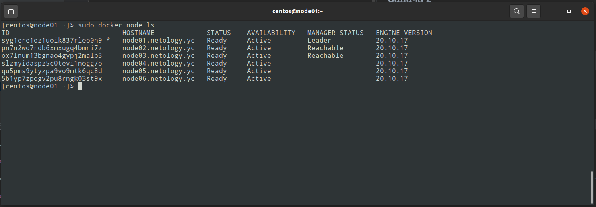
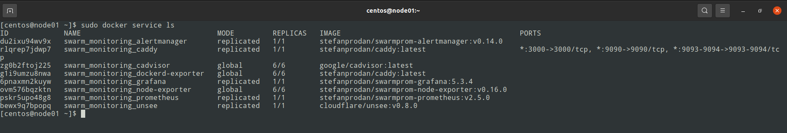

# Домашняя работа к занятию "5.5. Оркестрация кластером Docker контейнеров на примере Docker Swarm"


---

## Задача 1

Дайте письменые ответы на следующие вопросы:

- В чём отличие режимов работы сервисов в Docker Swarm кластере: replication и global?

> В режиме global сервис будет развернут на каждой из нод, а в режиме replication docker swarm будет поддерживать указанное в настройках количество активных нод с сервисом.

- Какой алгоритм выбора лидера используется в Docker Swarm кластере?

> Алгоритм поддержания распределенного консенсуса - RAFT.  

- Что такое Overlay Network?

> Сеть управления и обмена данными в docker swarm, "развернутая поверх" сетевой инфраструктуры (виртауальная сеть docker swarm для управления и обмена данными).  

## Задача 2

Создать ваш первый Docker Swarm кластер в Яндекс.Облаке

Для получения зачета, вам необходимо предоставить скриншот из терминала (консоли), с выводом команды:
```
docker node ls
```
> <p align="center">
>
> 
>
> </p>
## Задача 3

Создать ваш первый, готовый к боевой эксплуатации кластер мониторинга, состоящий из стека микросервисов.

Для получения зачета, вам необходимо предоставить скриншот из терминала (консоли), с выводом команды:
```
docker service ls
```
> <p align="center">
>
> 
>
> </p>
## Задача 4 (*)

Выполнить на лидере Docker Swarm кластера команду (указанную ниже) и дать письменное описание её функционала, что она делает и зачем она нужна:
```
# см.документацию: https://docs.docker.com/engine/swarm/swarm_manager_locking/
docker swarm update --autolock=true
```
> RAFT логи докера хранятся на диске в зашифрованном виде. При перезапуске докера ТЛС-ключи для доступа к Raft-логам загружаются в оперативную память каждой ноды для их шифровки/расшифровки. 
> У докера есть возможность защиты ключей шифрования. Данная команда включает режима автоблокировки ключей позволяя стать владельцем этих ключей и управлять разблокировкой менеджеров в ручном режиме.  
