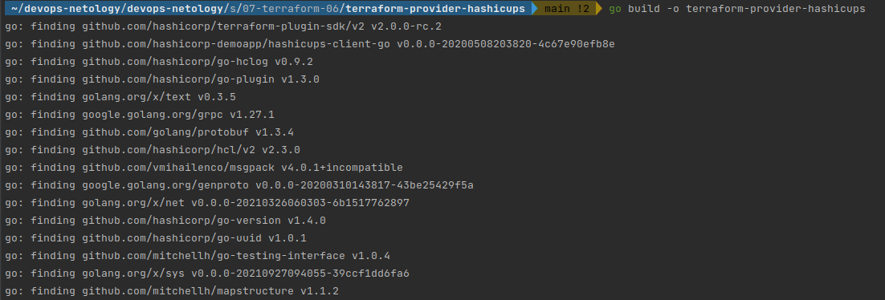

# Домашнее задание к занятию "7.6. Написание собственных провайдеров для Terraform."

Бывает, что 
* общедоступная документация по терраформ ресурсам не всегда достоверна,
* в документации не хватает каких-нибудь правил валидации или неточно описаны параметры,
* понадобиться использовать провайдер без официальной документации,
* может возникнуть необходимость написать свой провайдер для системы используемой в ваших проектах.   

## Задача 1. 
Давайте потренируемся читать исходный код AWS провайдера, который можно склонировать от сюда: 
[https://github.com/hashicorp/terraform-provider-aws.git](https://github.com/hashicorp/terraform-provider-aws.git).
Просто найдите нужные ресурсы в исходном коде и ответы на вопросы станут понятны.  

1. Найдите, где перечислены все доступные `resource` и `data_source`, приложите ссылку на эти строки в коде на 
гитхабе.   
> [Строка 415: DataSourcesMap](https://github.com/hashicorp/terraform-provider-aws/blob/main/internal/provider/provider.go)
> 
> 
> [Строка 925: ResourcesMap](https://github.com/hashicorp/terraform-provider-aws/blob/main/internal/provider/provider.go)
> 
> 
2. Для создания очереди сообщений SQS используется ресурс `aws_sqs_queue` у которого есть параметр `name`. 
    * С каким другим параметром конфликтует `name`? Приложите строчку кода, в которой это указано.
    * > [Строка 87 : ConflictsWith: string name_prefix](https://github.com/hashicorp/terraform-provider-aws/blob/main/internal/service/sqs/queue.go)
    * Какая максимальная длина имени? 
    * > [Строка 427](https://github.com/hashicorp/terraform-provider-aws/blob/main/internal/service/sqs/queue.go)
    * Какому регулярному выражению должно подчиняться имя? 
    * > Регулярное выражение: `^[a-zA-Z0-9_-]{1,80}$`
    
## Задача 2. (Не обязательно) 
В рамках вебинара и презентации мы разобрали как создать свой собственный провайдер на примере кофемашины. 
Также вот официальная документация о создании провайдера: 
[https://learn.hashicorp.com/collections/terraform/providers](https://learn.hashicorp.com/collections/terraform/providers).

1. Проделайте все шаги создания провайдера.
> Сделал.
2. В виде результата приложение ссылку на исходный код.
> [Директория с исходным кодом и скомпилированным файлом](https://github.com/ivan-titovich/devops-netology/tree/main/sysadmin/07-terraform-06-providers/hashicups)
3. Попробуйте скомпилировать провайдер, если получится то приложите снимок экрана с командой и результатом компиляции.
> 
